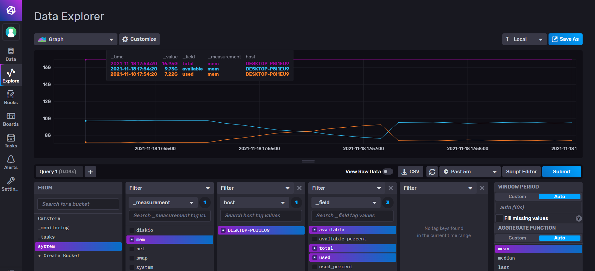

> 请阐述日志结构数据库适合什么样的应用场景？

+ 需要经常访问热数据的场景。日志结构数据库的热数据都位于上层，访问热数据速度更快；

+ 需要存储变长键值对的场景。
+ 对写性能要求比较高的场景。
+ value很长的场景，需要做键值分离。

> 请阐述日志结构数据库中的读放大和写放大分别是什么意思

+ 读放大：从日志结构数据库中读取值的过程：先判断是否Memtable中有该键值对，如果没有的话再一层层往下搜寻键值对。最坏情况下需要遍历所有的SSTable，造成较大的读放大。

+ 写放大：最坏情况下：写入MemTable，MemTable超过阈值，变成Immutable MemTable写入Level 0。Level 0可能溢出，和下面一层进行Compaction。运气不好的话可能需要进行很多层的Compaction，造成比较大的写放大。(而且还会涉及到WAL的写操作。)

> 日志结构合并树中，WAL的作用是什么？

在每次写入新数据的时候都会写入WAL。因为数据最开始是写在MemTable中的，如果服务器崩溃，那么在内存中的数据就会丢失。而WAL的作用就是可以让服务器在崩溃重启的时候将丢失的数据恢复。

> 请你在自己的机器上安装 InfluxDB，并像课程上所演示的一样监控你的笔记本电脑的状态，在Web界面的Explore中截图贴在Word文档中，并根据截图简要说明一下你的笔记本电脑的运行状态。

截图如上所示：在17:57:00左右打开了idea，导致了如上所示的CPU和内存的波动。可以看到内存和CPU占用率升高，在关闭idea之后，发现内存和CPU占用率下降。

