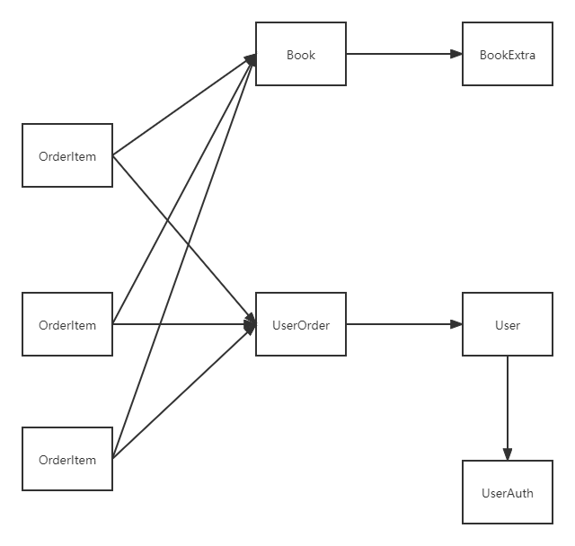

# MySQL Optimization

##### 你认为在你的数据库中应该建立什么样的索引？为什么？

应该在书籍等大表上建立多重索引。应保证主键的大小尽可能小（采用自增主键）；书的名字和作者经常被作为搜索的关键字，所以应该一同建立多重索引。并且书的名字在多重索引中应该位于作者的前面，因为很多情况下用户只会搜索书名。有些书的书名会比较长，因而可以考虑取一定长度的前缀作为索引。所以，对于书籍的表格而言，书籍的索引应该类似于index(bookTitle(20), bookAuthor)。（20是前缀长度，可以根据实际情况进行调整）

对于UserAuthority这种存放用户账号和密码的表，由于在登录的时候需要频繁地检测账号和密码是否匹配，而在我的系统中，用户名是不可以重复的，所以可以以账号进行单独索引（效果会很好，因为所有的账号都是不同的）

对于UserOrder这种用户存储用户订单的表，由于应用中经常需要根据用户ID获取订单和利用时间进行范围搜索，所以应该以用户ID和时间戳组合作为复合索引。

##### 你的数据库中每个表中的字段类型和长度是如何确定的？为什么？

数据库中的每个表中的字段类型和长度应该依据实际需求而定。比如，书籍的详情介绍一般都比较长，而且长短不一，应该设置为可变长字符串，使用varchar(500)已经足够了。

对于用户名，可以对长度加以限制，比如最大长度不能超过16，这样数据库使用varchar(16)即可。

而对于用户User这个表而言，后期可能需要对用户年龄进行分析，所以可能需要年龄这个字段。由于年龄是一个很小的数字，使用TINYINT即可，如此一来便可尽可能压缩空间。

对于书籍余量也是，不太可能有书的余量会达到int类型的上界，使用MEDIUMINT足矣。

都使用NOT NULL，尤其是作为索引的列。使用NOT NULL不仅能够便于代码的书写（在mysql中NULL不能用常规的处理方式），并且可以加快索引效率和节省空间（NOT NULL的类型不需要标识是否为NULL的标识位）

对于图片，比如用户头像，书籍封面等，使用BLOB类型。

##### 你认为在我们大二上课时讲解ORM映射的Person例子时，每个用户的邮箱如果只有一个，是否还有必要像上课那样将邮箱专门存储在一张表中，然后通过外键关联？为什么？

我认为这应该与实际需求有关。如果邮箱是经常需要被查询和修改的字段，并且通常需要和用户的其他字段合并使用，那么就不应该单独分出一个表出来，这样每次查询用户还需要一个join操作把邮箱给合并到搜索结果中，这对于大量的操作而言开销是比较大的（而且没有必要，因为要经常使用，并且邮箱实际上占用的空间并不大。）

但是如果邮箱信息不是常用信息，而且每次查询用户的时候也不需要返回邮箱这个字段，那么单独存储在一个表中并且通过外键关联也是可行的。并且，单独存在一个表格中，对于需要单独分析邮箱的应用会更方便（可能对于不关心用户信息，需要单独分析邮箱的情景比较合适）

##### 你认为主键使用自增主键和UUID各自的优缺点是什么？

自增主键简单方便，而且可以表征插入的时间顺序，且存储空间相对UUID比较小。但是如果同时有多个线程试图插入数据，这时候就需要通过上锁的方式保证ID能够正确自增，这会带来一定的开销，当并发量比较大的时候，这个开销也会相对比较大。在并发量小的情况下，由于主键索引是基于B+树的，采用自增主键会简单地从B+树的底层的右部简单地插入，而随机索引或者字符串索引，比如像UUID这种，则可能导致频繁的分裂和合并，影响效率。

UUID避免了自增ID需要上锁的问题，因为每个ID都是不同的。但是UUID比较长，占用空间比自增ID大；而且短时间内顺序插入的两条数据的UUID可能截然不同，这意味着UUID无法体现出时间顺序，对范围搜索不是很友好。并且如果应用需要体现时间顺序，可能需要额外存储时间戳。

##### 请你搜索参考文献，总结InnoDB和MyISAM两种存储引擎的主要差异，并详细说明你的E-BookStore项目应该选择哪种存储引擎。

InnoDB和MyISAM两种存储引擎的主要差异：

+ InnoDB支持事务，MyISAM不支持。
+ InnoDB支持外键，而MyISAM不支持。对一个包含外键的InnoDB表转为MYISAM会失败。
+ InnoDB是聚集索引，使用B+Tree作为索引结构，数据文件是和（主键）索引绑在一起的；MyISAM是非聚集索引，也是使用B+Tree作为索引结构，索引和数据文件是分离的，索引保存的是数据文件的指针。
+ InnoDB 最小的锁粒度是行锁，MyISAM 最小的锁粒度是表锁。
+ 系统奔溃后，MyISAM恢复起来更困难。

我的项目应该采用InnoDB存储引擎，原因如下：

+ 书店订书等服务存在很多transaction，而MyISAM不支持事务但InnoDB支持，满足项目要求；
+ 书店订书等行为会修改多个表格，对于InnoDB而言，锁的粒度比较小，因而效率要高于MyISAM；
+ 书店的书籍需要分成两个表格进行存储，这时候就需要外键将两个表联系起来，而MyISAM不支持外键，故应选择InnoDB；

+ 书店涉及到很多敏感的、重要的用户信息，比如用户订单，用户的余额等等。当系统发生故障的时候，必须要正确地恢复信息。InnoDB对于故障恢复会比MyISAM更容易一点。
+ 综上所述，我的项目需要使用InnoDB存储引擎。

##### 数据库设计方案

库结构：


表结构：

SQL语句：

```sql
drop schema homework;
create schema homework;
use homework;
create table book_extra
(
    id          int unsigned auto_increment primary key,
    cover       blob         not null,
    description varchar(500) not null,
    index (description(20)) # using prefix as index
);

create table book
(
    id       int unsigned auto_increment primary key,
    author   varchar(50)        not null,
    title    varchar(50)        not null,
    extra_id int unsigned       not null,
    price    decimal            not null,
    stock    mediumint unsigned not null,
    index (title, author),
    foreign key (extra_id) references book_extra (id)
) charset = UTF8;

create table user_auth
(
    id       int unsigned auto_increment primary key,
    username varchar(16)      not null,
    password varchar(16)      not null,
    identity tinyint unsigned not null default 0,
    index (username)
) charset = UTF8;

create table user
(
    id       int unsigned auto_increment primary key,
    nickname varchar(16)      not null,
    email    varchar(30)      not null,
    auth_id  int unsigned     not null,
    age      tinyint unsigned not null,
    index (nickname),
    foreign key (auth_id) references user_auth (id)
) charset = UTF8;

create table user_order
(
    id       int unsigned auto_increment primary key,
    time     datetime     not null,
    receiver varchar(50)  not null,
    address  varchar(100) not null,
    tel      varchar(30)  not null,
    user_id  int unsigned not null,
    index (user_id, time), # user will often search by this order
    foreign key (user_id) references user (id)
) charset = UTF8;

create table order_item
(
    id           int unsigned auto_increment primary key,
    book_id      int unsigned       not null,
    order_id     int unsigned       not null,
    purchase_num mediumint unsigned not null, # mediumint is sufficient
    index (order_id),
    foreign key (order_id) references user_order (id),
    foreign key (book_id) references book (id)
) charset = UTF8;
```

表与表之间的关联：

user => user_auth

order_item => book & user_order

user_order => user

book => book_extra



具体关系如上图所示。