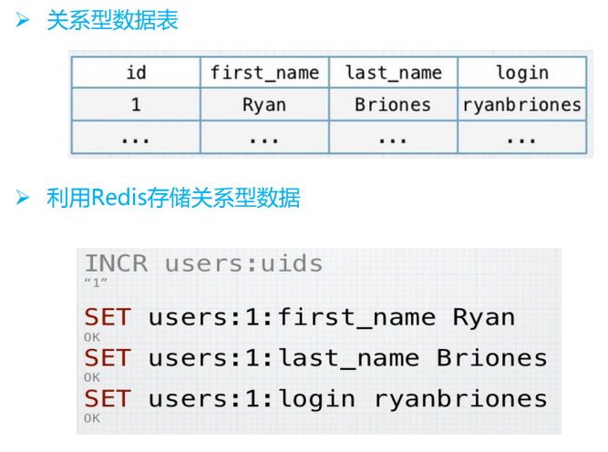

# Caching

### 概述

在分布式系统中，应用程序和数据库往往部署在不同的服务器上。因而应用服务器访问数据库需要通过网络协议。大量的数据库读写会耗费大量的时间，因而需要有若干台服务器在内存中对数据库内容进行缓存。一般内存缓存会使用Memcached或者Redis构成集群。以Redis为例，Redis有四种模式，常用的有主从模式。若干台服务器对缓存内容进行同步。虽然缓存服务器通常也被部署在和应用程序不同的服务器上，因而也要走网络协议获取。但是相比于读取数据库的磁盘访问，内存访问显然要快若干数量级。

注意到，Redis同样也会做持久化操作（这样断电之后就可以复原数据，Memcached不会做数据持久化），但是一般内存缓存都很小，可以指定存在SSD中，速度也不差。况且从数据库读数据到应用服务器还需要进行一步解析的操作，而Redis中可以保存java对象（会保存相关信息），所以从Redis持久化内容中读取速度是不差的。

Redis相比于Memcache在设置key的过期时间上更为灵活。前者可以动态设置，后者在set时设置。

### Cache + DB 读

一般流程如下：

+ 先从cache中尝试读取数据
+ 若hit，直接拿到数据并返回；若miss，执行下一步。
+ 从数据库读取数据
+ 把数据更新到缓存中，返回该数据。

其实和计算机组成中的缓存机制是很类似的。

### Cache + DB 写

相比于读，Cache + DB的写入就会显得很复杂，这涉及到数据一致性的问题。数据一致性分为如下三种：

+ **强一致性**：这种一致性级别是最符合用户直觉的，它要求系统写入什么，读出来的也会是什么，用户体验好，但实现起来往往对系统的性能影响大。
+ **弱一致性**：这种一致性级别约束了系统在写入成功后，不承诺立即可以读到写入的值，也不承诺多久之后数据能够达到一致，但会尽可能地保证到某个时间级别（比如秒级别）后，数据能够达到一致状态。
+ **最终一致性**：最终一致性是弱一致性的一个特例，系统会保证在一定时间内，能够达到一个数据一致的状态。这里之所以将最终一致性单独提出来，是因为它是弱一致性中非常推崇的一种一致性模型，也是业界在大型分布式系统的数据一致性上比较推崇的模型。

实际上，要保证强一致性是很耗费资源的。既然使用了cache，要么认为cache是高可信的，如此一来比较高效；要么就对一致性进行约束，如此一来又会影响系统性能。这两者本身就是一种tradeoff，不可能两全其美。

在读多写少的情况下，可以利用分布式锁（常用Redisson）进行上锁，但是分布式锁开销是很大的。既然采用了cache，其实不应该过多地关心一致性的问题，因为可以通过一些方式离线地对误差进行修正。

通常，如果不使用分布式锁的话，有三种可行的思路：

#### 1、先更新缓存，再更新数据库

这个方法看似很合理，但是该问题存在一个很严重的问题，那就是如果cache更新成功，但是写入数据库的时候失败，那么就会导致脏读问题（cache中的数据和数据库中的数据不一致。）

所以设置key的expire时间也很重要，不然就永远是脏数据，除非下次再次修改。

#### 2、先删除缓存，再更新数据库

这个方法避免了之前的问题：即使数据库写入失败，缓存中也没有数据，不会造成脏读。但是这同样无法避免脏读的发生：

+ B删除缓存
+ A读数据，缓存miss，从数据库中读取数据D
+ B修改数据库，将数据D‘写入
+ A把数据D’更新到缓存。

如何避免？延时双删：

```java
public void write(String key, Object value) {
    redis.delKey(key);
    db.updateData(value);
    Thread.sleep(1000);
    redis.delKey(key);
}
```

可以将第二次删除作为异步的。自己起一个线程，异步删除。这样，写的请求就不用沉睡一段时间后了，再返回。这么做，加大吞吐量。

3、先更新数据库，再删除缓存

3同样没有完全避免脏读的发生，假设A和B执行如下操作：

假设A，B执行如下操作：

+ A读取缓存，miss；
+ B更新数据库，将数据D‘写入数据库
+ B删除缓存
+ A从数据库获取旧数据D，修改缓存。

但是发生脏读的概率会比较低。要产生这种情况，第二步必须比第四步执行得慢。但是一般写数据到数据库会比把读出的数据缓存到缓存中要慢很多，所以这是个小概率事件。

但是无法避免如下情况：A在尝试更新缓存的时候发生了GC,GC的停顿可能会导致如上情况发生。

所以用上面这三种方法没有办法完全避免脏读的发生，不过可以通过离线修改或者修改key的过期时间来让脏数据过期（这也是个tradeoff。过期时间设置得太长，那么脏数据保存时间就会很长；如果太短，那么对于大量读的情况下，会导致大量的读不命中，得不偿失）

### Redis K-V design

#### 1. Key Name  

+ 以业务名为前缀，作为namespace区分不同的应用，还可以防止keyname冲突。 比如,b2c_开头的key是b2c业务的数据。 
+ key的名字能够言简意赅的体现数据内容，用“:”分割层次. SET b2c:orders:id 456977122 
+ Key的长度在30个字符以内。Redis最大允许的字符串长度为512M。 
+ 要包含空白字符（空格、换行符\r\n、单双引号以及其他需要转义的字符） 
+ 设计原则 
  + 高可读性 
  + 简洁性

#### 2. value的设计 

+ 单个key的体积要过大，大key拆分成多个小key：
  + String类型避免存储长度超过2k的字符串； 
  + List、Hash、Set和Zset的元素个数不要超过5000个。 

+ 尽可能使用简单的数据类型。
+ 选择合适的数据类型。

#### 3. 关系型数据转K-V



