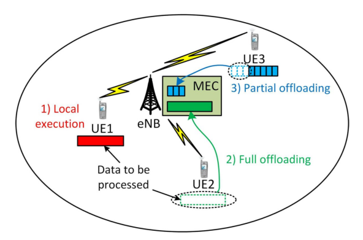
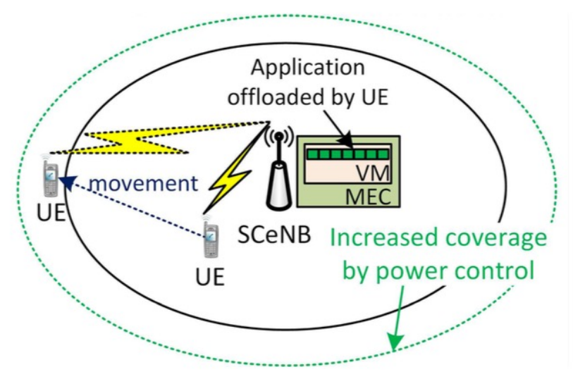
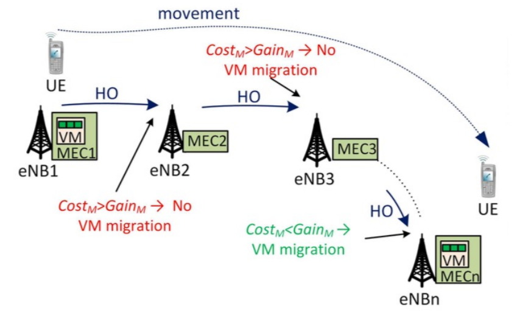

# Cloud Computing

## Term

+ Infrastructure-as-a-Service(IaaS) 
+ Platform-as-a-Service(PaaS)
+ Software-as-a-Service(SaaS).

## 概念

+ 云计算资源对用户屏蔽。硬件、计算资源以服务的方式共享。
+ 弹性资源
+ 虚拟化，以适应用户的需求。（不同用户需要不同的操作系统？）
+ 弹性价格
  + reserved 预定的
  + on-demand
  + on-spots 

+ 快速供给

### 边缘计算

+ 云是飘在天上的，而物就在身边。
+ 把计算资源分摊到边缘，把计算推到边缘去做，比如摄像头（具有一定计算能力）。
+ 云、边、端融合计算。
+ 边缘计算可能会比云计算更安全，在本地处理完毕。

##### 任务卸载

如果一个节点无法承担相应的算力，那么就可以把任务部分或全部地卸载给上一层，让上一层进行处理。

移动对基站的影响：需要更多的能量

虚拟机可能需要随着用户的移动而移动，虚拟机的迁移问题。有些课题研究这类问题，预测用户的移动提前架设好虚拟机。

通过预取内容提升效率（类似CDN？）

总而言之，移动边缘计算需要考虑这些资源迁移的花费问题。