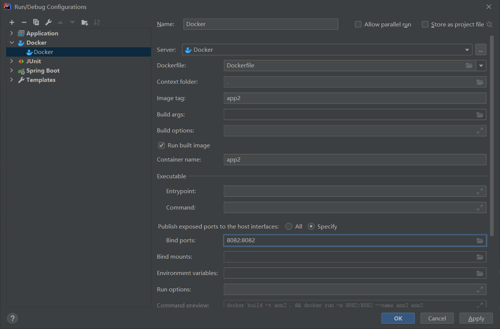
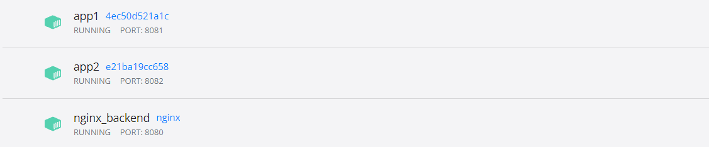
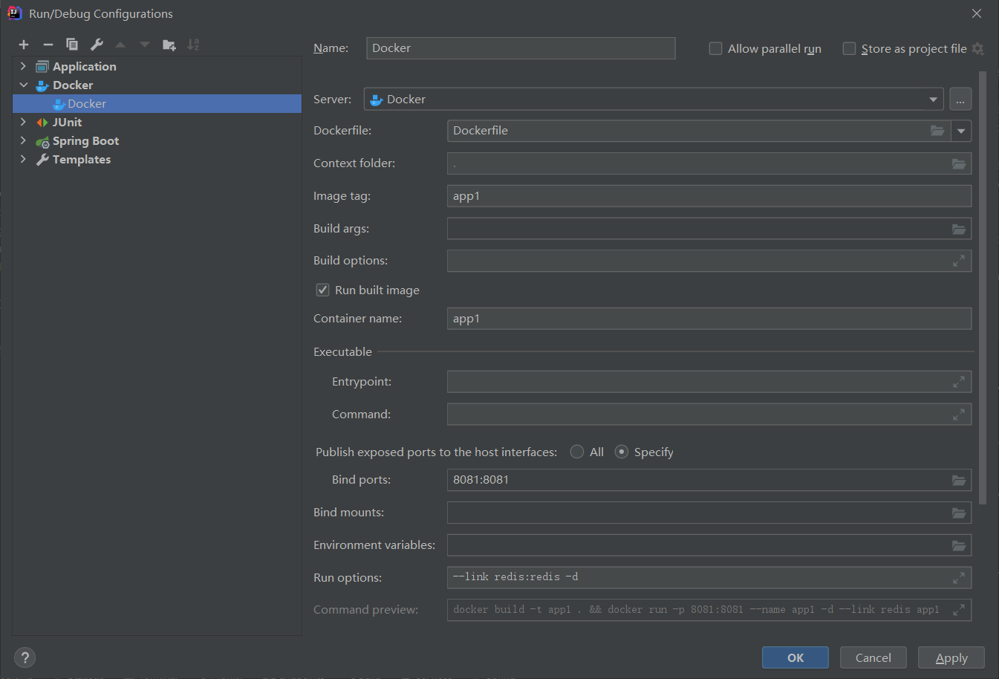
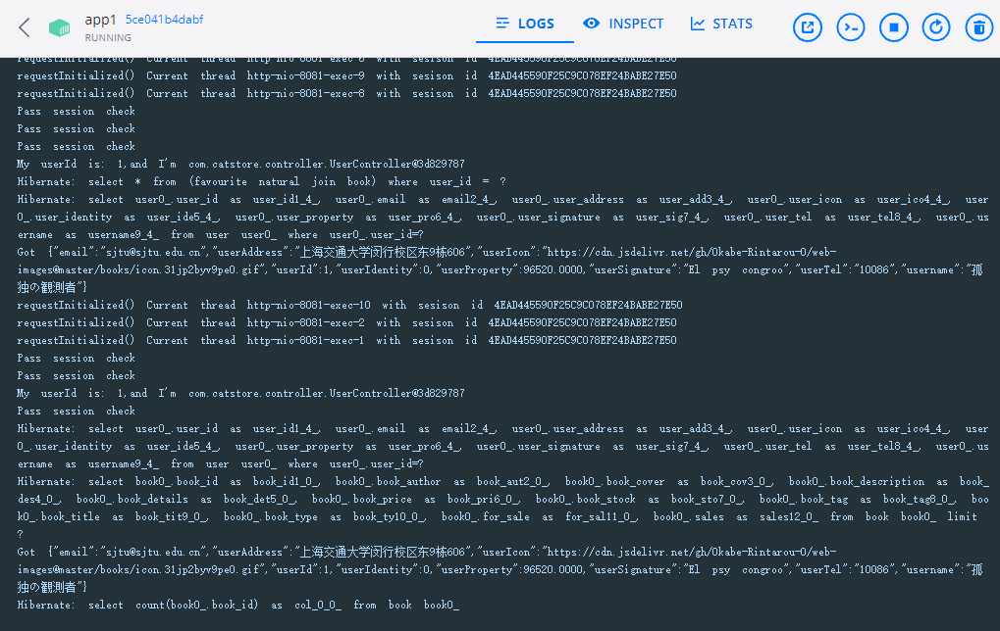
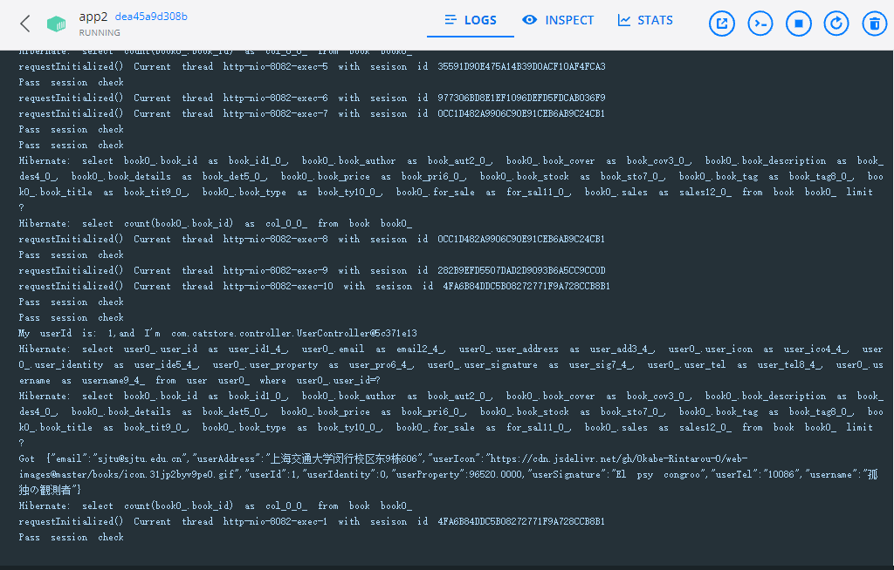
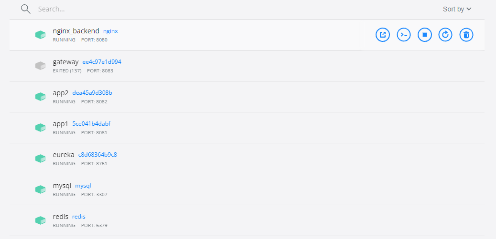

# 集群配置

### Docker

常用指令：

+ docker run -it --name -d [container_name]  [images] -v [local file]:[docker file]

  (-v 将本地文件/文件夹挂载到docker的文件/文件夹上。)

+ docker exec -it [container_name] bash

+ docker inspect [container_name]

+ docker ps -a

+ docker --network (指定容器网络)

+ **docker-compose**

容器访问宿主机端口:

> host.docker.internal:port (比如host.docker.internal:3306)

## Spring boot部署到docker

+ maven clean | maven package

+ 编写dockerfile（选择jdk对应的镜像，在dockerhub上找）

  ```dockerfile
  FROM openjdk:8u181
  
  #作者
  MAINTAINER lzh
  
  #系统编码
  ENV LANG=C.UTF-8 LC_ALL=C.UTF-8
  
  #声明一个挂载点，容器内此路径会对应宿主机的某个文件夹
  VOLUME /tmp
  
  #应用构建成功后的jar文件被复制到镜像内，名字也改成了app.jar
  ADD target/*.jar app.jar
  
  #启动容器时的进程
  ENTRYPOINT ["java","-jar","/app.jar"]
  
  #暴露8080端口
  EXPOSE 8080
  ```

+ 根据dockerfile将jar包部署到容器上。

+ 如果要访问宿主机数据库，注意host：**spring.datasource.url=jdbc:mysql://host.docker.internal:3306/...**
+ 

### Nginx配置

+ docker pull nginx
+ 由于在容器中修改配置文件比较麻烦，可以用docker run -v 指令将本地文件挂载到docker中。
+ 使用--link参数来指定连接的容器，前面是容器的全程，后面是该容器的代称。全程和代称都能唯一指定一个容器。可以在nginx的配置文件中利用link的代称或者全程来进行请求向其他容器的转发。（注意到docker中的网络和本地网络是不一样的。docker相当于使用了一个虚拟网卡，和本地网络用一个桥进行连接。）

> docker run -it --name nginx_backend -d -v D:/nginx.conf:/etc/nginx/nginx.conf -p 8080:80 --link app1:app1 --link app2:app2 nginx



nginx跑在8080上，两个app跑在8081和8082上。

### Redis配置

修改配置文件

> bind 127.0.0.1 #注释掉这部分，这是限制redis只能本地访问
> protected-mode no #默认yes，开启保护模式，限制为本地访问
> daemonize no#默认no，改为yes意为以守护进程方式启动，可后台运行，除非kill进程，改为yes会使配置文件方#式启动redis失败
> appendonly yes #redis持久化（可选）
> requirepass 123456 #个人测试使用的密码
> 注：这里VIM命令模式下搜索关键词来完成。（eg: /requirepass n向下查找）

docker启动redis

> docker run -p 6379:6379 --name myredis -v /usr/local/docker/redis.conf:/etc/redis/redis.conf -v /usr/local/docker/data:/data -d redis redis-server /etc/redis/redis.conf --appendonly yes

命令解释说明： -p 6379:6379 端口映射：前表示主机部分，：后表示容器部分。
--name myredis 指定该容器名称，查看和进行操作都比较方便。
-v 挂载目录，规则与端口映射相同。
-d redis 表示后台启动redis。
redis-server /etc/redis/redis.conf 以配置文件启动redis，加载容器内的conf文件，最终找到的是挂载的目录/usr/local/docker/redis.conf。
--appendonly yes 开启redis 持久化

其他容器要连接Redis同样可以用link指令。



### Redis共享Session

主要通过@EnableRedisHttpSession(maxInactiveIntervalInSeconds = 60)将Session共享到Redis上，然后其他都是类似的，几乎不用修改。（只不过原来Session是放在服务器上的，现在Session缓存到Redis上，解决了Session粘滞的问题。）

注意@Scope("session")和Redis一同使用出现的报错。

### 配置Mysql

+ 指定配置文件启动：

	> mysqld --defaults-file=/etc/mysql/mysql.cnf --user=root

+ 进入命令行

  > mysql -u root -p

+ mysqldump

  导出所有数据库数据（会导出到命令行当前所在目录下）

  > mysqldump -u root -p --all-databases > alldb.sql

  如果出现The user specified as a definer('xxx') does not exist when using LOCK TABLES 使用下面的语句

  > mysqldump --single-transaction -u root -p --all-databases> alldb.sql
  
  导入数据
  
  > mysql -u root -p < alldb.sql
  >
  > mysql> source alldb.sql (in the mysql CLI)

+ Docker开启mysql容器

  > docker run -it --name mysql -d -p 3307:3307 -e MYSQL_ROOT_PASSWORD=123 -v D:\mysql.conf:/etc/mysql/mysql.conf -v D:/mysql-files:/var/lib/mysql-files -v D:/alldb.sql:/etc/mysql/alldb.sql mysql mysqld --defaults-file=/etc/mysql/mysql.conf --user=root

+ 踩坑：mysql dump要在cmd下进行 不能用powershell 否则会有编码问题

### 整体结构

+ 两个后端app部署到容器上(分别为app1和app2)，端口号分别为8081和8082。

+ 使用nginx进行负载均衡，部署在docker的80端口，映射到宿主机8080端口。

+ 使用redis进行session共享，部署在6379端口上。

+ 使用mysql数据库，利用mysqldump把宿主机数据迁移到容器中，部署在docker 3306端口，映射到本机的3307端口。

+ 将两个app注册到eureka注册中心上（跑在8761端口上）

+ 前端跑在宿主机localhost:3000上，访问localhost:8080端口的api，映射到docker 80端口的nginx容器中，nginx通过负载均衡轮训转发给app1 或 app2。

+ 使用docker --link 指令实现容器之间的相互访问。（更方便的做法是使用docker --network）

+ nginx配置文件：

  ```nginx
  events {
    worker_connections  1024;  ## Default: 1024
  }
  http {
      upstream apps {
          #ip_hash;
          #least_conn;
          server app1:8081; 
          server app2:8082;
      }
      server {
          listen 80;
          server_name localhost;
          location / {
              root   html;
              index  index.html index.htm;
              proxy_pass http://apps;
          }
      }
  }
  ```
  
+ 运行

  前端能够正常登录，且两台后端服务器均收到了请求：

  
  
  
  
+ 整体容器一览

  
