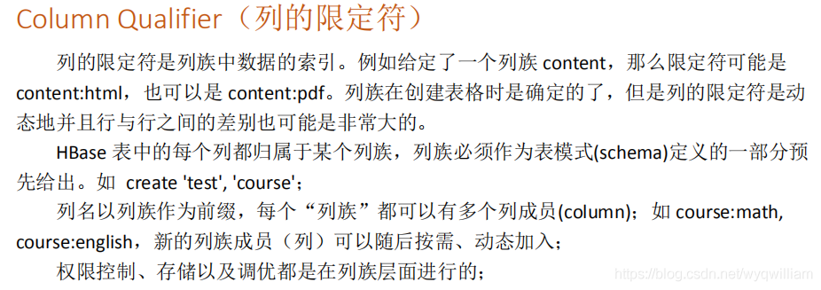
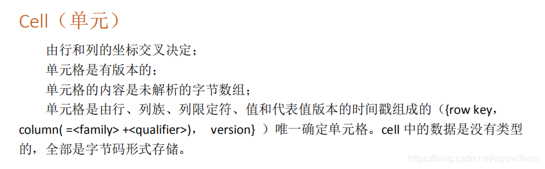
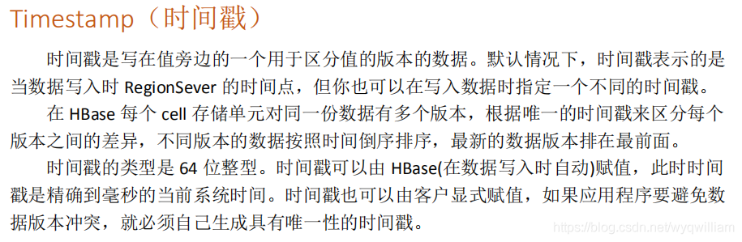

# HBase

+ 以region为最小单位，由若干个行组成。由于行是排序的，所以可以包含一个范围的行。
+ 数据可以按列进行压缩。
+ Schema不严格，一行可以没有某些属性。看起来是个稀疏的表格，但是在存储的是不会存储那些不存在的属性。
+ 表格的行根据主键排序（字典序）。所以行的主键的设计很重要，比如网站的url，应该逆序存储。保证尽可能把相近的内容存储在同一块区域。
+ 列族，按列存，对于动态加入列族非常友好。

+ 内嵌zookeeper，无需自己起一个。
+ 如果一行太大，可以存到列族里。列族按顺序存储若干行，但是列族间是独立的。所以列族不能太多，太多的话索引会比较多，影响效率。
+ 关系型数据库的表存的是数据结构相似的，而HBase的表存的是语义上相关的数据，对结构要求不严格。

+ Cell是有版本的，默认返回最新的数据。

+ 版本理论和逻辑上可以无限叠加。
+ 时间戳可以用户自定义，（但是要记住默认返回的时间戳最大的版本，所以如果是自定义的话可能返回的不是最新的版本），以此来节省空间（时间戳是长整型）。而且自定义逻辑时间戳可以更好发现两个版本之间存在一个版本的情况，而默认时间戳无法做到这一点。

### Schema rules

+ Region应该比较大。
+ Cell不应该太大，如果太大可以考虑分离存储。（存一个pointer）
+ 一个table不应该有太多的列族。
+ 一个有一两个列族的表应该有50-100个region（注意到列族是按列存储的）
+ 行的主键不应该太大。

+ 列族在不同的地方存储，使用一个列族的时候不用加载其他列族。