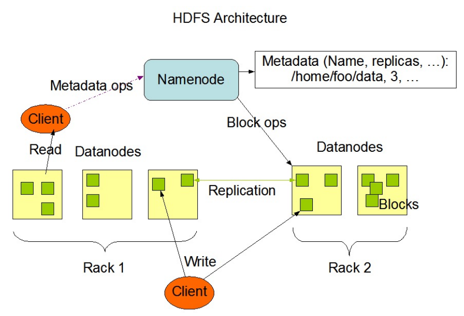
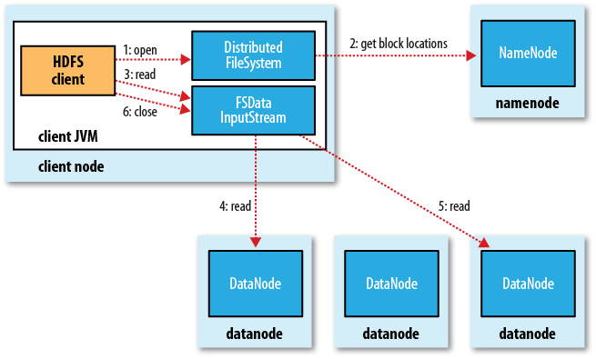
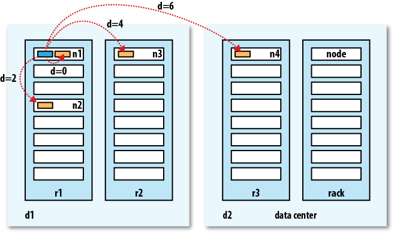
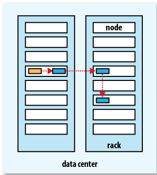
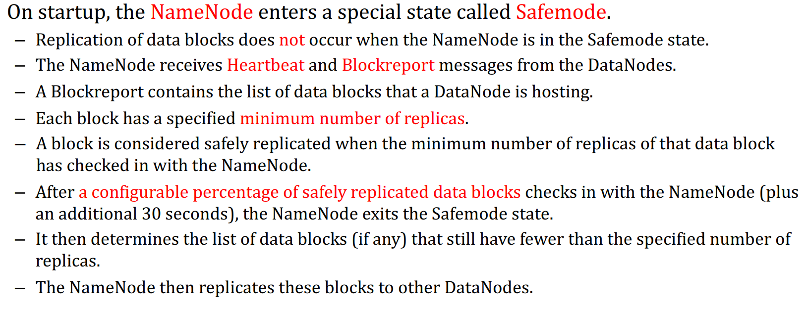

# HDFS

### 适用场景

+ 非常大的文件（指的是hundreds of megabytes, gigabytes, or terabytes级别的文件）；
+ 适合write-once，read-many-times的流式读的场景。
+ 只需要商业级的标准硬件即可，对硬件要求不高。

不适用的场景：

+ 有很多writer；
+ 修改随机位置（HDFS适合顺序append）
+ 有很多小文件。

### 基本概念

+ Block 默认128MB
+ 采用master/slave 模式：
  + master管理命名空间和用户对文件的操作。master即namenode，管理有关命名空间的操作，比如打开关闭文件和重命名。Namenode还存有有关命名空间的元数据。
  + slaves即datanode。通常集群中的每个节点都拥有一个datanode。会根据namenode的指令指向一些相关动作，比如block的创建，删除等。
+ 在这点上非常像GFS，GFS也是一个master对应若干个chunkservers，然后把文件分为多个chunk。

通常一台机子跑一个datanode，当然不限制一台机子跑多个datanodes，但是现实中很少这么做。

### 数据备份

+ 用户可以自定义replica的数量，这被称为***replication factor***，这个信息保存在namenode中。每个文件的block size还有replication factor都是可以指定的。

+ Namenode会周期性地收到来自datanode的心跳，用于确认datanode是否在正常工作。
+ 同时，datanode还会发送blockreport（包含一个所有block的列表）给namenode。

> 在Hadoop集群中如何衡量两个节点的远近呢？要知道，在高速处理数据时，数据处理速率的唯一限制因素就是数据在不同节点间的传输速度：这是由带宽的可怕匮乏引起的。所以我们把带宽作为衡量两个节点距离大小的标准。
> 但是计算两个节点之间的带宽是比较复杂的，而且它需要在一个静态的集群下才能衡量，但Hadoop集群一般是随着数据处理的规模动态变化的（且两两节点直接相连的连接数是节点数的平方）。于是Hadoop使用了一个简单的方法来衡量距离，它把集群内的网络表示成一个树结构，两个节点之间的距离就是他们离共同祖先节点的距离之和。树一般按数据中心(datacenter)，机架(rack)，计算节点(datanode)的结构组织。计算节点上的本地运算速度最快，跨数据中心的计算速度最慢（现在跨数据中心的Hadoop集群用的还很少，一般都是在一个数据中心内做运算的）

备份的时候是由近及远的，如下图所示：

在hadoop启动namenode的时候，会启动安全模式（safemode），在该模式下，namenode会等待datanode向它发送块报告（block report），只有接收到的datanode上的块数量（datanodes  blocks）和实际的数量（total blocks）接近一致， 超过  datanodes blocks /  total blocks >= 99.9%  这个阀值，就表示 块数量一致，就会推出安全模式。达到99.9%的阀值之后，文件系统不会立即退出安全模式，而是会等待30秒之后才会退出。

在安全模式下不可以进行以下操作：

1）创建文件夹

2）上传文件

3）删除文件

注意：启动了namenode，未启动datanode，则文件系统处于安全模式，只可以查看文件系统上有哪些文件，不可以查看文件内容，因为datanode都还没启动，怎么可能可以查看文件内容。

### 持久化

+ Namenode会在本地文件系统存储两个文档：
  + **EditLog**：记录诸如配置信息变化，新建文件等操作，常用的**WAL(Write Ahead Log)**；
  + **FsImage**：blocks映射等文件的元数据。

+ Datanode会把数据存储在多个目录下（采用启发式，如果都放在同一目录下，可能受限于文件系统不能存放那么多的文件。）
+ Datanode在启动的时候会扫描收集文件块的信息，然后以blockreport的形式发送给Namenode。
