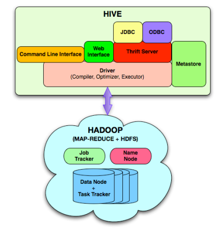

# Hive

### 概述

hive是基于Hadoop的一个数据仓库工具，用来进行数据提取、转化、加载，这是一种可以存储、查询和分析存储在Hadoop中的大规模数据的机制。hive数据仓库工具能将结构化的数据文件映射为一张数据库表，并提供SQL查询功能，能将SQL语句转变成MapReduce任务来执行。Hive的优点是学习成本低，可以通过类似SQL语句实现快速MapReduce统计，使MapReduce变得更加简单，而不必开发专门的MapReduce应用程序。hive十分适合对数据仓库进行统计分析。

### 数据湖和数据仓

+ 把各种数据库的原始文件存入数据湖中；
  + 可以在数据湖中直接做查询；也可以把数据湖中“热”的数据存放在数据仓库中。
+ Hive使用了schema on read。
  + schema on write：多数的数据库，即数据在存放的时候按照某个结构进行存储；
  + schema on read：Lazy的表现。存的时候不会严格要求schema，只管把数据存进去；读取的时候按照某一schema读取。

+ 数据存入数据仓库前，需要经过ETL。
  + **ETL**，是英文Extract-Transform-Load的缩写，用来描述将数据从来源端经过抽取（extract）、转换（transform）、加载（load）至目的端的过程。**ETL**一词较常用在数据仓库，但其对象并不限于数据仓库。
  + 比如把某些数据的单位统一，比如货币单位从美元转为人民币
  + 删除一些无用的数据，总之是一个筛选的过程

+ Hive是基于HDFS的，而HDFS又是Hadoop的一部分。
+ Hive拥有类似于SQL的查询语句，每个查询都基于MapReduce。
+ Hive支持如下文件格式：
  + Text File
  + SequenceFile
  + RCFile
  + Avro File
  + ORC File
  + Parquet（多种数据库都可以转换到这种统一格式，便于存储进Hive中）
  + Custom INPUTFORMAT and OUTPUTFORMAT

