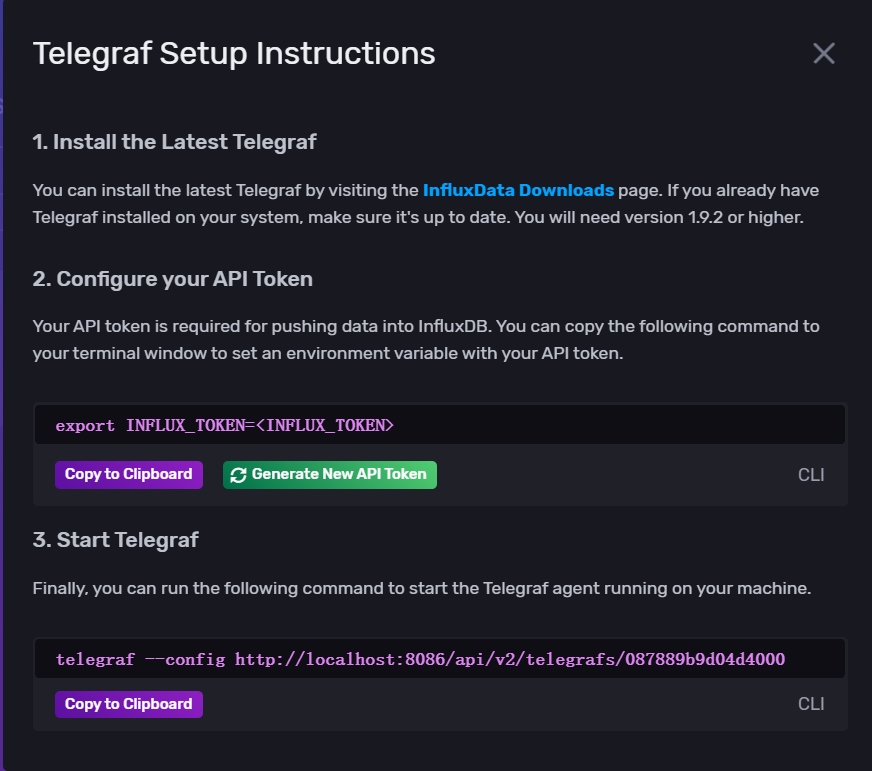

# LSMT & TS DB

### TS DB

+ 对热的数据更感兴趣。

+ 关系数据库没有retention policy。（数据有生命周期，到达一定时间删除数据。）

#### Influx DB

+ timestamp 和 measurement 是固定的。

+ Tag可以建立索引，Field不可以。（所以应该把经常查询的field转成tag建立索引；把不常用的tag转换成field。）

+ field数据为 123，-1，1...（后面为delta），这样的数据存储方式很难建立索引。

+ Series：
  + A series key is a collection of points that share a measurement, tag set, and field key；
  + 只有时间戳不一样，构成一个序列。

+ storage engine

  + 使用POST方法写入数据；

  + 每次存一个batch，压缩，追加WAL日志条目；
  + 内存缓存定期以TSM files的格式flush到磁盘；

  + 与LSMT类似，分层。
  + TSM 文件以列格式存储压缩的系列数据。
    + 为了提高效率，存储引擎只存储一系列值之间的差异（或增量）。
    + 面向列的存储让引擎通过系列键读取并忽略无关数据。

+ 配置过程：

  + Windows:

    + 下载InfluxDB：[Install InfluxDB | InfluxDB OSS 2.1 Documentation (influxdata.com)](https://docs.influxdata.com/influxdb/v2.1/install/)

    + 下载telegraf（采集数据）：

    + 创建配置：

      

    + 复制配置到本地telegraf.conf

      

    + 打开powershell，windows下应为：

      ```shell
      $export:INFLUX_TOKEN = "xxx"
      ```

    + 运行telegraf:

      ```shell
      .\telegraf --config .\telegraf.config
      ```

      

