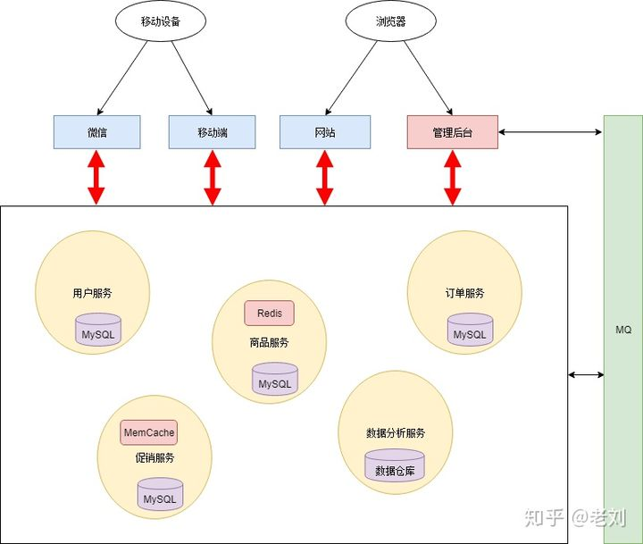
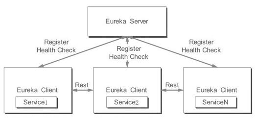
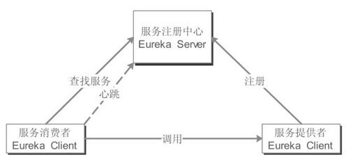
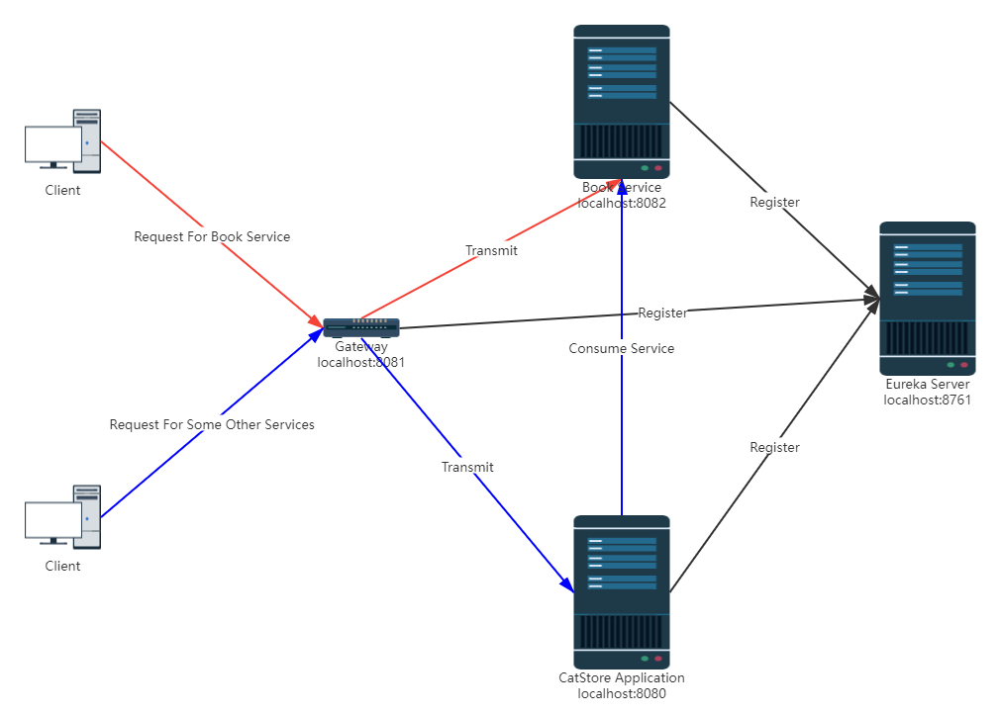
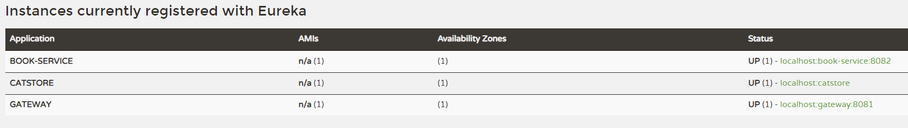
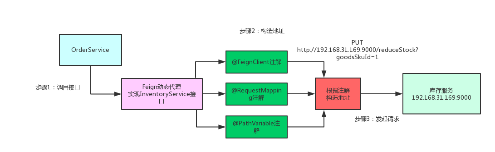
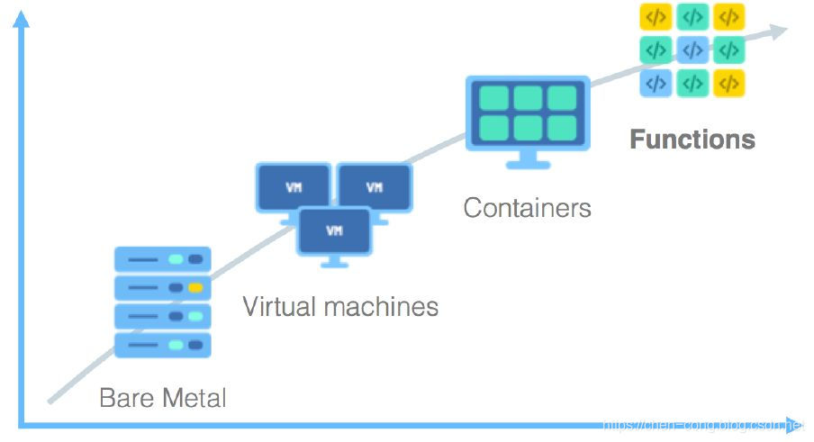

# Micro Service & Serverless

### Micro Service

#### 整体技术栈

+ **Spring cloud gateway/Zuul**
+ **Eureka**
+ **Feign**

#### 概述

微服务是现代集群系统主流的设计方案。通过将服务抽离出来，实现了和其他服务的解耦，显得更加灵活，可调。一个服务独立于另一个服务，但是不代表两者之间没有交集，两者仍然可以通过MQ等方式相互交流。

服务独立有很多好处：

+ 可以针对某一个服务调配不同的资源：比如一个服务比较吃资源，可以给它配备更好的硬件；一个服务有很多读操作，但是写操作相对比较少，那么就可以对该服务使用redis/memcached等缓存；
+ 可以更方便地实现复用；一个微服务可以服务于多个应用服务器；
+ 解耦；
+ 一个微服务在使用的时候不会影响另一个微服务（因为不共用数据库）



#### Eureka

Eureka是Netflix开发的一个服务发现框架，本身是一个基于REST的服务，主要用于定位运行在AWS(Amazon Web Services )域中的中间层服务，以达到负载均衡和中间层服务故障转移的目的。Spring Cloud将其集成在自己的子项目Spring Cloud Netflix中，以实现Spring Cloud的服务发现功能。

Eureka 的服务发现包含两大组件：**服务端发现组件(Eureka Server)**和**客户端发现组件(Eureka Client)**。服务端发现组件也被称之为服务注册中心，主要提供了服务的注册功能，而客户端发现组件主要用于处理服务的注册与发现。Eureka的服务发现机制如图：



从上图中可以看出，当客户端服务通过注解等方式嵌入到程序的代码中运行时，客户端发现组件就会向注册中心注册自身提供的服务，并**周期性地发送心跳来更新服务**(默认时间为30s，如果连续三次心跳都不能够发现服务，那么Eureka就会将这个服务节点从服务注册表中移除)。与此同时，客户端发现组件还会从服务端查询当前注册的服务信息并缓存到本地，即使 Eureka Server出现了问题，客户端组件也可以通过缓存中的信息调用服务节点的服务。各个服务之间会通过注册中心的注册信息以**Rest方式**来实现调用，并且可以直接通过服务名进行调用。

Eureka 的服务发现机制包含了 3 个角色：服务注册中心、服务提供者和服务消费者。这 3个角色之间的关系如下图所示：



上图中，服务注册中心即Eureka Server，而服务提供者和服务消费者是Eureka Client。这里的服务提供者是指提供服务的应用，可以是Spring Boot应用，也可以是其他技术平台且遵循Eureka通信机制的应用，应用在运行时会自动地将自己提供的服务注册到Eureka Server以供其他应用发现。

服务消费者就是需要服务的应用，该服务在运行时会从服务注册中心获取服务列表，然后通过服务列表知道去何处调用其他服务。服务消费者会与服务注册中心保持心跳连接，一旦服务提供者的地址发生变更时，注册中心会通知服务消费者。

**需要注意的是，Eureka 服务提供者和服务消费者之间的角色是可以相互转换的，因为一个服务既可能是服务消费者，同时也可能是服务提供者。**

摘自：http://java.itheima.com/news/20210325/163145.html

#### Gateway

网关通过将请求URL映射到不同的服务器网址。对于客户端而言，不需要知道网关背后的服务器的具体地址，只需要知道网关的存在，即可完成对一系列服务的请求，因为网关实现了反向代理的功能（网关背后的服务对客户端而言是透明的。）

这样一来，一旦某个服务修改了端口号或者地址，只需要修改网关的映射关系即可，无序修改客户端代码。

而且，一般网关都会和Eureka的注册中心配合使用。网关自身作为服务注册到Eureka server，这样就能通过Eureka Server获知其他service的地址。也就是说，我们甚至都不需要修改网关，即可动态完成调整（因为Eureka Server会通知每个Eureka Client 某一client的变更。）

#### 搭建Eureka Server

Spring boot 版本 2.2.0 RELEASE

依赖：

Spring cloud:

```xml
<!-- https://mvnrepository.com/artifact/org.springframework.cloud/spring-cloud-dependencies -->
<dependency>
    <groupId>org.springframework.cloud</groupId>
    <artifactId>spring-cloud-dependencies</artifactId>
    <version>Hoxton.SR6</version>
    <type>pom</type>
    <scope>runtime</scope>
</dependency>
```

Eureka:

```xml
<!-- https://mvnrepository.com/artifact/org.springframework.cloud/spring-cloud-starter-netflix-eureka-server -->
<dependency>
    <groupId>org.springframework.cloud</groupId>
    <artifactId>spring-cloud-starter-netflix-eureka-server</artifactId>
    <version>2.2.0.RELEASE</version>
</dependency>
```

application.properties:

```properties
server.port=8761
eureka.client.register-with-eureka=false
eureka.client.fetch-registry=false
logging.level.com.netflix.eureka=OFF
logging.level.com.netflix.discovery=OFF
```

#### 搭建Gateway

Zuul 和 Spring boot gateway 采用的是不同的servlet，前者使用spring-starter-web，后者使用的是webflux。

**如果要使用后者，必须把依赖中的spring-starter-web删除。**

依赖：

```xml
<dependency>
    <groupId>org.springframework.boot</groupId>
    <artifactId>spring-boot-starter-actuator</artifactId>
    <version>2.2.0.RELEASE</version>
</dependency>
<dependency>
    <groupId>org.springframework.cloud</groupId>
    <artifactId>spring-cloud-starter-gateway</artifactId>
    <version>2.2.0.RELEASE</version>
</dependency>
<!-- https://mvnrepository.com/artifact/org.springframework.cloud/spring-cloud-starter-netflix-eureka-client -->
<dependency>
    <groupId>org.springframework.cloud</groupId>
    <artifactId>spring-cloud-starter-netflix-eureka-client</artifactId>
    <version>2.2.0.RELEASE</version>
</dependency>
<!-- https://mvnrepository.com/artifact/org.springframework.cloud/spring-cloud-dependencies -->
<dependency>
    <groupId>org.springframework.cloud</groupId>
    <artifactId>spring-cloud-dependencies</artifactId>
    <version>Hoxton.SR6</version>
    <type>pom</type>
    <scope>runtime</scope>
</dependency>
```

指定路由规则（使用RouteLocatorBuilder）

在gateway中配置uri配置有三种方式：

+ ws(websocket)方式: uri: ws://localhost:9000
+ http方式: uri: http://localhost:8130/
+ lb(注册中心中服务名字)方式: uri: lb://brilliance-consumer

使用的是第三种方法，即配合Erureka使用。

编码：

```java
@Configuration
public class RouteConfig {
    @Bean
    public RouteLocator routeLocator(RouteLocatorBuilder routeLocatorBuilder) {
        return routeLocatorBuilder.routes()
                .route(r -> r.path("/book/**")
                        //                        .filters(f -> f.rewritePath("/book", ""))
                        .uri("lb://BOOK-SERVICE") // use Eureka register center to find service url by service name
                )
                .build();
    }
}
```

该RouteLocator将所有以/book开头的请求都通过Eureka转发中心转发到BOOK-SERVICE对应的服务上。

#### 最终结构

整体结构如下所示：



使用Eureka + Spring Cloud Gateway，实现对特定指令的转发。红色箭头代表请求的转发过程。

效果：



对"http://localhost:8082/book/author/动物庄园"和"http://localhost:8081/book/author/动物庄园" 的请求效果都是一样的：即直接访问和通过网关访问都是可行的。

文件结构：

```
.
├── CatStore
	├── ...
    	└── catstore-backend
		├── ...
		├── bookservice 
        	├── eureka_server
 		└── gateway
```

#### 微服务之间的相互调用

使用工具**Feign**, 基于AOP完成相关请求的代码自动注入，避免冗长的调用工作。其工作很像RPC中的stub或者Web service中封装的client，让用户感觉就在本地调用接口一样。

##### 原理：



##### 编码：

利用强大的动态代理，通过两个Annotation即可实现上述功能：

+ **@EnableFeignClients**: 放在启动类上即可；

+ **@FeignClient**：放在新建的client接口上即可。

  | 参数          | 作用                                                 |
  | ------------- | ---------------------------------------------------- |
  | value         | 对应于调用的微服务的服务名，比如我这边是book-service |
  | configuration | 配置类，默认FeignAutoConfiguration.class即可         |

client接口：

```java
@Component
@FeignClient(value = "book-service", configuration = FeignAutoConfiguration.class)
public interface BookServiceClient {
    @GetMapping("/book/author/{title}")
    String getAuthorByTitle(@PathVariable(name = "title") String title);
}
```

自动注入并调用即可，就和在本地调用几乎无区别。AOP省去了中间请求代码的编写，解放了程序员，好耶！

```java
@GetMapping("/author/{title}")
@SkipSessionCheck
String getAuthorByTitle(@PathVariable(name = "title") String title) {
    return bookServiceClient.getAuthorByTitle(title);
}
```

#### 网关的选择

主流的网关：

+ Nginx
+ Zuul
+ Spring cloud gateway
+ linkerd

##### 简单总结

+ 根据测试情况，多种网关中Nginx的性能无疑是最好的，无论是淘宝的Tengine的功能增强，还是OpenResty的模块增强，都是对Nginx优化。不过从定位来说，我比较倾向于把它定位为传统的只是承载请求转发的工具，对于我们开发的技术栈没那么友好。另外，OpenResty有一个lua-resty-mysql模块，可做mysql的网关，我们没用过，不知道性能如何。

+ zuul和gateway，都是可以无缝对接spring cloud，结合服务发现，对服务层来说可以做到屏蔽机器资源（ip或内外网域名等），服务对机器无依赖性。它们的定位是融合在微服务的网关，承载着对微服务增强的功能。对于二次开发的易用性来说，两者对我们开发上手都比较容易。

+ zuul和gateway对比，根据测试情况，gateway的性能还是比zuul好很多的。另外，gateway的也有很多zuul没有的功能，比如支持http2、websocket，根据域名转发等。对于做服务转发，而不是数据库转发这种高性能要求，性能上和Nginx差距不大。**gateway可以更方便地融入spring cloud的体系**。

+ linkerd则是服务网格的概念了，linkerd的原理是系统代理请求，对服务是无侵入性的，有比较成熟的监控管理界面。gateway的官方测试是，gateway性能比linkerd好很多，但是在我的虚拟机上测试，两者差不多。linkerd结合docker和k8s使用，对机器资源的抽象就更上一层。linkerd更像是应用程序或者说微服务间的 TCP/IP，网络监控、限流、熔断对服务层来说是透明无感的。

以上，个人感觉是不同维度的东西，可以根据自己的功能需求、开发技术栈等，来选取对应的网关。

参考：[网关选择困难症](https://www.edjdhbb.com/2018/12/16/%E7%BD%91%E5%85%B3%E9%80%89%E6%8B%A9%E5%9B%B0%E9%9A%BE%E7%97%87/)

### Serverless

#### 概述



云计算涌现出很多改变传统IT架构和运维方式的新技术，比如虚拟机、容器、微服务，无论这些技术应用在哪些场景，**降低成本**、**提升效率**是云服务永恒的主题。

过去十年来，我们已经把应用和环境中很多通用的部分变成了服务。Serverless的出现，带来了跨越式变革。**Serverless把主机管理、操作系统管理、资源分配、扩容，甚至是应用逻辑的全部组件都外包出去，把它们看作某种形式的商品——厂商提供服务，我们掏钱购买**。

过去是“**构建一个框架运行在一台服务器上，对多个事件进行响应**”，Serverless则变为“**构建或使用一个微服务或微功能来响应一个事件**”，做到当访问时，调入相关资源开始运行，运行完成后，卸载所有开销，真正做到按需按次计费。这是云计算向纵深发展的一种自然而然的过程。

Serverless是一种构建和管理基于微服务架构的完整流程，允许你在服务部署级别而不是服务器部署级别来管理你的应用部署。它与传统架构的不同之处在于，完全由第三方管理，由事件触发，存在于**无状态（Stateless）**、**暂存（可能只存在于一次调用的过程中）计算容器内**。构建无服务器应用程序意味着开发者可以专注在产品代码上，而无须管理和操作云端或本地的服务器或运行时。Serverless真正做到了部署应用无需涉及基础设施的建设，自动构建、部署和启动服务。

国内外的各大云厂商 Amazon、微软、Google、IBM、阿里云、腾讯云、华为云相继推出Serverless产品，Serverless也从概念、愿景逐步走向落地，在各企业、公司应用开来。

#### 编码

使用MapReduce进行计算：

```java
@Bean
public Function<Flux<BookPurchaseInfo>, Publisher<BigDecimal>> calcBill() {
    return flux -> flux
            .map(info -> info.price.multiply(BigDecimal.valueOf(info.purchaseNumber)))
            .reduce(BigDecimal::add);
}
```
