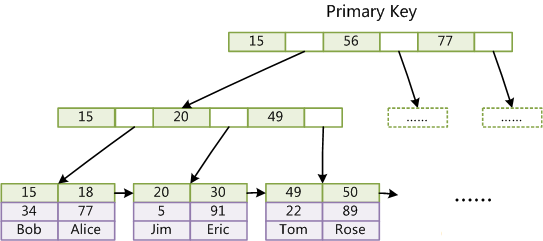

# MySQL Optimization

### 阅读清单

+ https://www.cnblogs.com/wilburxu/p/9435818.html
+ https://www.cnblogs.com/boboshenqi/p/10334229.html

### MySQL存储方式

+ MySQL存储表默认是一行一行顺序存储，所以为了加快检索速度（让更多的行被加载到内存中），可以分成多个表；

+ 对于TEXT/BLOB, 可以考虑存文件路径；

+ OLAP 一列一列存；OLTP 一行一行存。 两者结合：HTAP（Hybrid Transaction and Analytical Process,混合事务和分析处理）；

+ 通过优化数据大小优化存储：

  + 尽可能使用最小的存储类型，比如INT如果条件允许可以换成MEDIUMINT, 比INT小25%的空间，如此一来既可以节省内存和磁盘空间；
  + 尽可能使用NOT NULL的列，因为：
    + 更方便做索引（有NULL的话都会堆积在一起）；
    + 节省判断是否为空的overhead；
    + 如果可以为NULL的话会多占一个bit用于表征当前行的数据是否为NULL;
    + 便于SQL语言书写，NULL的查询并不好处理。
  + 如果要用NULL的话，记得列是默认允许为NULL的，要把不需要NULL的列设置为NOT NULL；

+ 行格式（Row format）

  
  + InnoDB 表默认使用 DYNAMIC 行格式创建。 
  + 要使用 DYNAMIC 以外的行格式，请配置 innodb_default_row_format，或在 CREATE TABLE 或 ALTER TABLE 语句中显式指定 ROW_FORMAT 选项。
  +  紧凑的行格式系列（包括 COMPACT、DYNAMIC 和 COMPRESSED）减少了行存储空间，但代价是增加了某些操作的 CPU 使用率。
  + 当使用可变长度字符集（例如 utf8mb3 或 utf8mb4）时，紧凑的行格式系列还优化了 CHAR 列存储。
  + 当 ROW_FORMAT=REDUNDANT 时，CHAR(N) 占用 N × 字符集的最大字节长度。 许多语言可以主要使用单字节 utf8 字符编写，因此固定的存储长度通常会浪费空间。
  + 使用紧凑的行格式系列，InnoDB 通过去除尾随空格为这些列分配 N 到 N × 字符集的最大字节长度范围内的可变存储量。 最小存储长度为 N 字节，以便在典型情况下进行就地更新。
  
+ 优化BLOB类型：像消息摘要一样比较hash值，而不是比较BLOB数据本身。

+ varchar 需要额外两个字节记录到底放了多少个字符。

+ Optimize Table（时间长了会变得碎片化）

+ 根据访问策略确定存储模式（SSD？HD？）

### 索引相关优化

MySQL中InnoDB的索引结构：

InnoDB使用B+Tree作为索引结构。

InnoDB的数据文件本身就是索引文件。在InnoDB中，表数据文件本身就是按B+Tree组织的一个索引结构，这棵树的叶节点data域保存了完整的数据记录。这个索引的key是数据表的主键，因此InnoDB表数据文件本身就是主索引。



上图为InnoDB主索引（同时也是数据文件）的示意图，可以看到叶节点包含了完整的数据记录。这种索引叫做聚集索引。因为InnoDB的数据文件本身要按主键聚集，所以InnoDB要求表必须有主键（MyISAM可以没有），如果没有显式指定，则MySQL系统会自动选择一个可以唯一标识数据记录的列作为主键，如果不存在这种列，则MySQL自动为InnoDB表生成一个隐含字段作为主键，这个字段长度为6个字节，类型为长整形。

第二个与MyISAM索引的不同是InnoDB的辅助索引data域存储相应记录主键的值而不是地址。换句话说，InnoDB的所有辅助索引都引用主键作为data域。例如，下图为定义在Col3上的一个辅助索引：


这里以英文字符的ASCII码作为比较准则。聚集索引这种实现方式使得按主键的搜索十分高效，但是辅助索引搜索需要检索两遍索引：**首先检索辅助索引获得主键，然后用主键到主索引中检索获得记录**。

了解不同存储引擎的索引实现方式对于正确使用和优化索引都非常有帮助，例如知道了InnoDB的索引实现后，就很容易明白为什么**不建议使用过长的字段作为主键**，因为所有辅助索引都引用主索引，过长的主索引会令辅助索引变得过大。再例如，用非单调的字段作为主键在InnoDB中不是个好主意，因为InnoDB数据文件本身是一颗B+Tree，**非单调的主键会造成在插入新记录时数据文件为了维持B+Tree的特性而频繁的分裂调整**，十分低效，而使用自增字段作为主键则是一个很好的选择。

+ 可以使用前缀建立索引：Index(column_name)；

+ 主键必须索引；
+ InnoDB 反向索引；
+ 如果一列有大量重复、为空的数据，那么索引的作用就不大；
+ 表比较小的话，没有必要建立索引；
+ 总而言之，索引适用于在大表上搜索少量数据；
+ UUID 避免上锁的问题，但是16字节比自增ID要大一倍。但是自增ID能够表明插入的先后顺序，UUID可能需要额外存一个时间戳；

+ 如果搜索词超过索引前缀长度，则使用索引排除不匹配的行，并检查剩余的行以寻找可能的匹配项；
+ 根据搜索需求建立索引，**多重索引和搜索的顺序要对应上**；
+ 以下情况索引会生效(假设建立复合索引(first,second))：
  + WHERE first = ?1 **<u>AND</u>** second = ?2
  + WHERE first = ?1
+ 以下情况索引不会生效(假设建立复合索引(first,second))或者还是会全局进行扫描：
  + WHERE second = ?1
  + WHERE first = ?1 **<u>OR</u>** second = ?2
+ 以通配符开头的搜索将无法利用索引：SELECT * FROM tbl_name WHERE key_col LIKE '%Patrick%’；
+ **多重索引搜索效率和修改效率是tradeoff**（索引项越多，搜索越快，但是写操作的时候调整索引速度就会比较慢）；

+ Hash索引
  + 仅用于使用 = 或 <=> 运算符（但速度非常快）的相等比较。
  + Hash索引无法加速ORDER BY操作
  + MySQL 无法确定两个值之间大约有多少行（范围优化器使用它来决定使用哪个索引）。（对范围搜索没什么作用）
  + 只能使用完整的一个键来搜索一行。 

+ 升降序索引

  ```mysql
  CREATE TABLE t (
      c1 INT, c2 INT,
      INDEX idx1 (c1 ASC, c2 ASC),
      INDEX idx2 (c1 ASC, c2 DESC),
      INDEX idx3 (c1 DESC, c2 ASC),
      INDEX idx4 (c1 DESC, c2 DESC)
  );
  ORDER BY c1 ASC, c2 ASC -- optimizer can use idx1
  ORDER BY c1 DESC, c2 DESC -- optimizer can use idx4
  ORDER BY c1 ASC, c2 DESC -- optimizer can use idx2
  ORDER BY c1 DESC, c2 ASC -- optimizer can use idx3
  ```

  ### 范式化

