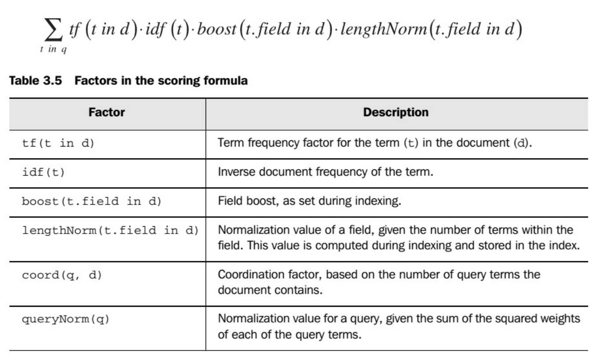

# Searching

### 概述

在很多应用场景下，我们都需要对一些数据内容进行搜索，比如根据书籍简介和给定关键字检索书籍。但是通过数据库的模糊搜索去搜索大量书籍的简介文本是非常耗时间的事情，这时候就需要全文搜索对相关文本进行反向索引。

常用的全文搜索工具有**Lucene**，**Solr**和**Elasticsearch**。

### Lucene

#### 概述

Lucene是跑在Servlet中的一个工具。其结构如下所示：


主要分为索引和搜索两个模块。

首先Lucene会将多种数据源（XML,TXT,HTML甚至数据库）解析生成Index Document，再将document进行索引。

接着，客户端可以通过建立的索引进行搜索。

整体流程非常清晰、简单。

#### 核心类

##### 索引过程中的核心类

+ **Document**：他是承载数据的实体（他可以集合信息域Field），是一个抽象的概念，一条记录经过索引之后，就是以一个Document的形式存储在索引文件中的。
+ **Field**：索引中的每一个Document对象都包含一个或者多个不同的域(Field),域是由域名(name)和域值(value)对组成，每一个域都包含一段相应的数据信息。
+ **IndexWriter**：索引过程的核心组件。这个类用于创建一个新的索引并且把文档 加到已有的索引中去，也就是写入操作。
+ **Directroy**：是索引的存放位置，是个抽象类。具体的子类提供特定的存储索引的地址。（**FSDirectory** 将索引存放在指定的磁盘中，**RAMDirectory** ·将索引存放在内存中。）
+ **Analyzer**：分词器，在文本被索引之前，需要经过分词器处理，他负责从将被索引的文档中提取词汇单元，并剔除剩下的无用信息（停止词汇），分词器十分关键，因为不同的分词器，解析相同的文档结果会有很大的不同。**Analyzer**是一个**抽象类**，是**所有分词器的基类**。

##### 搜索过程中的核心类

+ **IndexSearcher**：调用它的search方法，用于搜索**IndexWriter** 所创建的索引。
+ **Term**： **Term** 使用于搜索的一个基本单元。
+ **Query**：Lucene中含有多种查询（Query）子类。它们用于查询条件的限定其中**TermQuery** 是Lucene提供的最基本的查询类型，也是最简单的，它主要用来匹配在指定的域（Field）中包含了特定项(Term)的文档。
+ **TermQuery** :Query下的一个子类TermQuery（单词条查询） ，Query lucene中有很多类似的子类。
+ **TopDocs**: 是一个**存放有序搜索结果指针**的简单容器，在这里搜索的结果是指匹配一个查询条件的一系列的文档。

#### Field相关属性
| Field名称             | 相关描述                                                     |
| :-------------------- | :----------------------------------------------------------- |
| IntField              | 主要对int类型的字段进行存储，需要注意的是如果需要对InfField进行排序使用SortField.Type.INT来比较，如果进范围查询或过滤，需要采用NumericRangeQuery.newIntRange() |
| LongField             | 主要处理Long类型的字段的存储，排序使用SortField.Type.Long,如果进行范围查询或过滤利用NumericRangeQuery.newLongRange()，LongField常用来进行时间戳的排序，保存System.currentTimeMillions() |
| FloatField            | 对Float类型的字段进行存储，排序采用SortField.Type.Float,范围查询采用NumericRangeQuery.newFloatRange() |
| BinaryDocVluesField   | 只存储不共享值，如果需要共享值可以用SortedDocValuesField     |
| NumericDocValuesField | 用于数值类型的Field的排序(预排序)，需要在要排序的field后添加一个同名的NumericDocValuesField |
| SortedDocValuesField  | 用于String类型的Field的排序，需要在StringField后添加同名的SortedDocValuesField |
| StringField           | 用户String类型的字段的存储，StringField是只索引不分词        |
| TextField             | 对String类型的字段进行存储，TextField和StringField的不同是TextField既索引又分词 |
| StoredField           | 存储Field的值，可以用IndexSearcher.doc和IndexReader.document来获取此Field和存储的值 |

| 变量名          | 释义               |
| --------------- | ------------------ |
| TYPE_NOT_STORED | 索引，分词，不存储 |
| TYPE_STORED     | 索引，分词，存储   |

#### 编码

##### 索引过程

Lucene提供了完备的java接口，可以很简易地通过编码完成索引和搜索的工作。

```java
private static void index(String indexDirPath, String filePath) throws IOException {
    Directory indexDir = FSDirectory.open(Paths.get(indexDirPath));
    // 可以自定义stop words
    Analyzer analyzer = new StandardAnalyzer(readStopWords());

    IndexWriterConfig indexWriterConfig = new IndexWriterConfig(analyzer);
    // 是否生成混合文件（把多个文件集合到一起 会影响效率）
    indexWriterConfig.setUseCompoundFile(false);

    IndexWriter writer = new IndexWriter(indexDir, indexWriterConfig);

    BufferedReader br = new BufferedReader(new InputStreamReader(new FileInputStream(filePath), StandardCharsets.UTF_8));

    String line;
    while ((line = br.readLine()) != null) {
        System.out.println("Read line: " + line);
        JSONObject jsonObj = JSONObject.parseObject(line);
        Document document = new Document();
        document.add(new Field(SearchingFields.Details, jsonObj.getString(SearchingFields.Details), TextField.TYPE_STORED));
        document.add(new Field(SearchingFields.BookId, jsonObj.getString(SearchingFields.BookId), StringField.TYPE_STORED));
        writer.addDocument(document);
    }
    br.close();
    writer.close();
}
```

解析：

首先需要制定生成index的目录，**FSDirectory**是指磁盘上的目录，**indexDirPath**代表目录的路径。

其次，需要**Analyzer**，即分词器，可以通过构造函数传递stop words参数。

接着是**IndexWriterConfig**，包含索引的相关配置信息，包括采用的分词器，是否生成混合文件（把生成的.fdm等格式的文件合并成一个文件）等。

我在filePath对应的文本中存储了书籍的待索引信息（书籍id + 书籍详情）。通过读取文件再次解析，并构建出响应的**document**加入索引中。

注意到**bookId**使用了**StringField**，该field不会被分词，但是会被索引。由于我们最后需要的就是一组bookId，所以使用**TYPE_STORED**属性。

而details很自然地使用了**TextField**，并且也使用了**TYPE_STORED**属性，即不但索引、分词而且存储。

如此一来便可以完成索引的工作。

##### 搜索过程

```java
public static List<Integer> searchBooksBy(String keyword) {
    List<Integer> bookIdList = new ArrayList<>();
    try {
        FSDirectory indexDir = FSDirectory.open(Paths.get(LuceneIndexer.INDEX_DIR));
        IndexReader reader = DirectoryReader.open(indexDir);
        IndexSearcher indexSearcher = new IndexSearcher(reader);

        Term term = new Term(SearchingFields.Details, keyword);
        Query query = new TermQuery(term);
        TopDocs topDocs = indexSearcher.search(query, Constant.BOOK_PAGE_SIZE);
        ScoreDoc[] scoreDocs = topDocs.scoreDocs;
        for (ScoreDoc scoreDoc : scoreDocs) {
            Document document = reader.document(scoreDoc.doc);
            bookIdList.add(Integer.valueOf(document.get(SearchingFields.BookId)));
            //                System.out.println(reader.document(scoreDoc.doc));
            //                System.out.println("Explanation:" + (indexSearcher.explain(query, scoreDoc.doc)));
        }
    } catch (IOException e) {
        e.printStackTrace();
    }
    return bookIdList;
}
```

搜索过程其实也和很简单，此处不多赘述。

search函数中的第二个参数n代表前n条搜索结果。

注释部分会解释查询结果以及每个查询项对应的得分。

#### 特性

+ Lucene有点像数据库，但是和数据库其实非常不一样。因为它没有严格的格式，拥有不同field的document可以一同进行索引；

+ 可以在一个document的一个field上append多个value；

+ Lucene不支持只修改document中的某一field；

+ Lucene中的每一个document都有一个默认为1的评分权重，可以通过setBoost方法让某些东西更容易被搜到或者相反（参考微博热搜XD）

+ 除了常用的TermQuery，Lucene还支持这样的搜索：

  ```java
  Query query = QueryParser.parse("+JUNIT+ANT-MOCK", "contents", new SimpleAnalyzer());
  ```

#### Scoring

理解lucene中的评分机制：



+ **文档权重(Document boost)**：在索引时给某个文档设置的权重值。
+ **域权重(Field boost)**：在查询的时候给某个域设置的权重值。
+ **调整因子(Coord)**：基于文档中包含查询关键词个数计算出来的调整因子。一般而言，如果一个文档中相比其它的文档出现了更多的查询关键词，那么其值越大。
+ 逆文档频率(Inerse document frequency)：基于Term的一个因子，存在的意义是告诉打分公式一个词的稀有程度。其值越低，词越稀有(这里的值是指单纯的频率，即多少个文档中出现了该词；而非指Lucene中idf的计算公式)。打分公式利用这个因子提升包含稀有词文档的权重。
+ **长度归一化(Length norm)**：基于域的一个归一化因子。其值由给定域中Term的个数决定(在索引文档的时候已经计算出来了，并且存储到了索引中)。域的文本越长，因子的权重越低。这表明Lucene打分公式偏向于域包含Term少的文档。
+ **词频(Term frequency)**：基于Term的一个因子。用来描述给定Term在一个文档中出现的次数，词频越大，文档的得分越大。
+ 查询归一化因子(Query norm)：基于查询语句的归一化因子。其值为查询语句中每一个查询词权重的平方和。查询归一化因子使得比较不同查询语句的得分变得可行，当然比较不同查询语句得分并不总是那么易于实现和可行的。
  

### Solr

#### 概述

Solr是基于Lucene的另一个全文搜索工具，不同于Lucene一样比较轻量级，可以直接跑在tomcat里面，Solr必须要另起一个应用程序，像redis一样跑在某一个端口上。

#### 配置流程

Windows：参考：https://blog.csdn.net/u010510107/article/details/81051795

#### 基本概念

+ 由多个cores组成一个逻辑索引叫做一个collection。一个collection本质上是一个可以跨越多个核的索引，同时包含冗余索引；
+ 一个core主要是一个文档集中text和field的索引，本质上是一个solr进程；
+ 一个solr实例可以包含多个core,每个core根据本地一定的标准互相分开。它去提供结不同的搜索接口给用户，或者提供权限让不同用户有不同权限去访问不同文档；

#### 编码

##### 索引过程

```java
private static void index(String indexDirPath, String filePath) throws IOException, SolrServerException {
    SolrClient client = SolrUtil.getSolrClient();


    BufferedReader br = new BufferedReader(new InputStreamReader(new FileInputStream(filePath), StandardCharsets.UTF_8));
    String line;
    while ((line = br.readLine()) != null) {
        System.out.println("Read line: " + line);
        JSONObject jsonObj = JSONObject.parseObject(line);
        SolrInputDocument document = new SolrInputDocument();
        document.addField(SearchingFields.BookId, jsonObj.getString(SearchingFields.BookId));
        document.addField(SearchingFields.Details, jsonObj.getString(SearchingFields.Details));


        UpdateResponse updateResponse = client.add(document);
        client.commit();
    }
    br.close();
}
```

##### 搜索过程

```java
public static List<Integer> searchBooksBy(String keyword) {
    List<Integer> bookIdList = new ArrayList<>();
    SolrClient client = SolrUtil.getSolrClient();
    final SolrQuery query = new SolrQuery(SearchingFields.Details + ":" + keyword);
    query.addField(SearchingFields.BookId);
    query.setSort("id", SolrQuery.ORDER.desc);
    try {
        QueryResponse response = client.query(query);
        List<SolrDocument> documents = response.getResults();
        for (SolrDocument document : documents) {
            Integer bookId = Integer.valueOf(document.getFirstValue(SearchingFields.BookId).toString());
            bookIdList.add(bookId);
        }
    } catch (SolrServerException | IOException e) {
        e.printStackTrace();
    }

    return bookIdList;
}
```

### Elasticsearch

ELK中的中的“E"，越来越多应用选择使用Elasticsearch。
