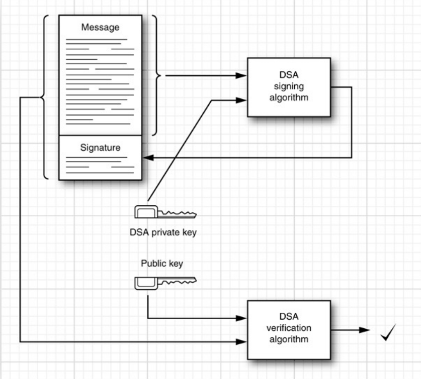
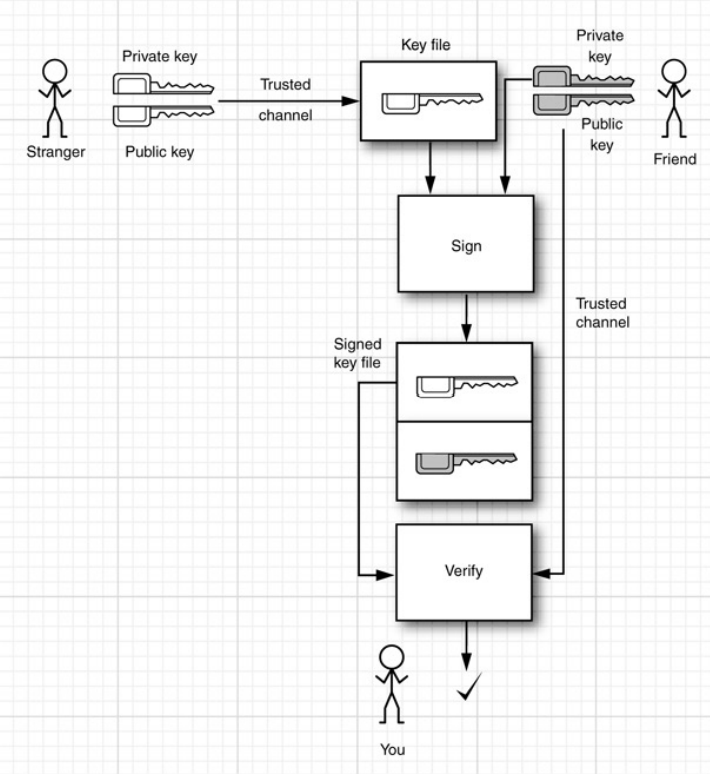
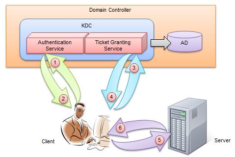

# Security

### Message Digest

消息摘要算法的主要特征是加密过程不需要密钥，并且经过加密的数据无法被解密，可以被解密逆向的只有[CRC32](https://baike.baidu.com/item/CRC32/7460858)算法，只有输入相同的明文数据经过相同的消息摘要算法才能得到相同的密文。

消息摘要能够用于识别内容是否被人拦截篡改。

消息摘要有以下特点：

+ 即使只是修改消息中的一个字，其消息摘要也会发生显著的变化。所以无法伪造出具有相同消息摘要的内容；
+ 无论内容多大，其消息摘要的长度都是固定的。

生成摘要的算法是**公共**的，即客户端和服务器都知道生成消息摘要的算法是什么。客户端拿到数据之后可以把数据生成对应的消息摘要，并把生成的摘要和服务器发过来的摘要进行对比，如果摘要不相同，那么就说明内容被篡改了。

### Message Signing

摘要存在一个问题：如果拦截者把内容修改后也重新生成了一份摘要发给用户，那么上述的消息摘要就失效了，所以要保证消息摘要不能被修改。

这时候就需要对消息进行签名：使用不对称加密。

+ 只有私钥才能解开公钥加密的内容；
+ 只有公钥才能解开私钥加密的内容；
+ 私钥保存在服务器内部，不公开；
+ 如果内容被拦截并修改，由于拦截者没有私钥，所以被篡改过的内容客户端无法用公钥解开。

服务器签名过程：

+ 生成消息摘要；
+ 使用私钥对消息摘要进行加密；



客户端检验过程：

+ 用服务器分发的公钥解开加密过的消息摘要；

+ 使用公开的消息摘要算法对数据生成消息摘要，判断两个摘要是否相同。

### Authentication Problem

上面的方式依旧存在问题：用户如何判定服务器分发的公钥就是安全可信的呢？



使用第三方电子签证机关(Certificate Authority)。CA使用私钥加密服务器的公钥文件，如果客户端能够用CA分发的公钥解开加密过的公钥文件，那么就说明该公钥是可以信任的。

### TLS/SSL

+ 传输层安全 (TLS) 及其前身安全套接字层 (SSL) 
  + 是允许 Web 浏览器和 Web 服务器通过安全连接进行通信的技术。  
  +  这意味着正在发送的数据由一侧加密，传输，然后在处理之前由另一侧解密。
  + 这是一个双向过程，这意味着服务器和浏览器在发送数据之前都会加密所有流量。
+ SSL/TLS 协议的另一个重要方面是身份验证。
  + 这意味着在您最初尝试通过安全连接与网络服务器通信时，该服务器将以“证书”的形式向您的网络浏览器提供一组凭据，作为该站点是谁以及它是什么的证明。
  + 在某些情况下，服务器还可能从您的网络浏览器请求证书，要求证明您是您所声称的人。
  + 这被称为“客户端身份验证”，尽管实际上这更多地用于企业对企业 (B2B) 交易而不是个人用户。
  + 大多数启用 SSL 的 Web 服务器不请求客户端身份验证。

### Symmetric Cipher/Asymmetric Cipher

对称加密效率更高，但是不安全；非对称加密相反。

思路：用非对称加密传输对称加密的秘钥。只在第一次使用非对称加密，后面交互都适用对称加密。

### Key Generation

+ 使用java自带的keytool：

  windows:

  ```
  “%JAVA_HOME%\bin\keytool”	-genkey -alias	tomcat	-keyalg RSA -keystore
  “C:\Tomcat\conf\key\tomcat.keystore” -validity	365
  ```

  linux:

  ```
  $JAVA_HOME/bin/keytool -genkey -alias	tomcat	-keyalg RSA -keystore	./conf/key/tomcat.keystore
  -validity	365
  ```


使用外置的Tomcat：

+ 修改Tomcat的配置文件：

  ```xml
  <Connector port=“8443”
  	protocol="org.apache.coyote.http11.Http11NioProtocol"
  	maxThreads="150" SSLEnabled="true"
  	keystoreFile="/Users/chenhaopeng/apache-tomcat-9.0.31/conf/key/tomcat.keystore"
  	keystorePass="changeit">
  </Connector>
  ```


使用内置的Tomcat（Spring Boot）：

+ 修改配置文件：

  ```properties
  server.port=8443
  server.ssl.key-store=/Users/chenhaopeng/apache-tomcat-9.0.31/conf/key/tomcat.keystore
  server.ssl.key-store-password=changeit
  server.ssl.keyAlias=tomcat
  ```

### Single Sign-On

单点认证。

#### Kerberos

**Kerberos**是一种计算机网络授权协议，用来在非安全[网络](https://baike.baidu.com/item/网络)中，对个人通信以安全的手段进行身份认证。这个词又指麻省理工学院为这个协议开发的一套计算机软件。



用户登陆的时候输入的密码明文传输是不安全的。因而在传递登录信息的时候，只是传递用户名。

AS(Authentication Service)：

+ 消息A：AS会从数据库中找到用户名对应的密码，把密码Hash得到的结果作为秘钥，并用该秘钥加密TGS Key（客户端和服务器交互的Key），把加了密的TGS Key发送给客户端。客户端用相同的算法生成秘钥将TGS Key解密；
+ 消息B：AS对TGS key使用公钥加密传给客户端，其中还包括一些有关客户端的信息。

Client:

+ 消息C： 客户端把加过密的TGS key原封不动转交给TGS；
+ 消息D：客户端把个人信息和时间戳用TGS Key加密发给TGS。

TGS(Ticket Granting Service)：

+ TGS 这边是不会保存TGS Key的；

+ 用自己的秘钥解密加密过的TGS Key（消息C）， 获得其中的客户端信息；
+ 用TGS Key 解密消息D，获得用户信息；
+ 核对获取的两个用户信息，确定客户端身份；
+ 消息E：发送用TGS Key加密过的Client和Server交互的Session Key；
+ 消息F：把用Server的公钥加密的Ticket发送给客户端。（Ticket Granting！）

Client:

+ 用TGS Key解密消息E获取Session Key；
+ 把Session Key和Ticket发给Server；

Server：

+ 用私钥解开加密过的Ticket，如果解得开，认证成功，开启交互；
+ 双向验证（发送时间戳，客户端得以知道Server不是钓鱼网站）

TGS的key一般有效期比较长，短时间内不用再次认证，即单点认证。

缺点：

+ 如果AS/TGS崩了，整个系统就崩了=>修改为分布式集群；

+ 分布式时间同步存在难度，而该系统对时间准确性要求比较高（很多消息需要传递时间戳（防止被拦截和伪造））；使用Time Service。

### Some Keywords

JDBC的Prepared Statement。

入侵检测，撞库。

### References

+ [谈谈基于Kerberos的Windows Network Authentication上篇](https://www.cnblogs.com/artech/archive/2007/07/05/807492.html)

+ [谈谈基于Kerberos的Windows Network Authentication - Part II](https://www.cnblogs.com/artech/archive/2007/07/07/809545.html)

