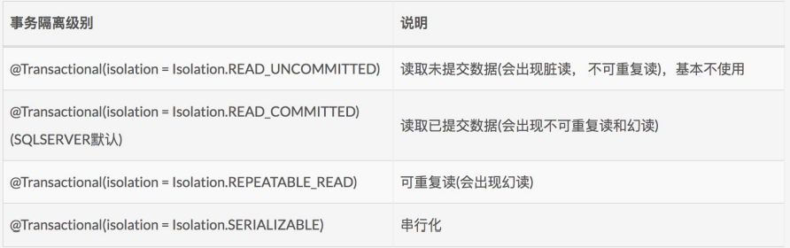

# Transaction

### ACID

- Atomicity（原子性）：一个事务（transaction）中的所有操作，要么全部完成，要么全部不完成，不会结束在中间某个环节。事务在执行过程中发生错误，会被恢复（Rollback）到事务开始前的状态，就像这个事务从来没有执行过一样。
- Consistency（一致性）：在事务开始之前和事务结束以后，数据库的完整性没有被破坏。这表示写入的资料必须完全符合所有的预设规则，这包含资料的精确度、串联性以及后续数据库可以自发性地完成预定的工作。
- Isolation（隔离性）：数据库允许多个并发事务同时对其数据进行读写和修改的能力，隔离性可以防止多个事务并发执行时由于交叉执行而导致数据的不一致。事务隔离分为不同级别，包括读未提交（Read uncommitted）、读提交（read committed）、可重复读（repeatable read）和串行化（Serializable）。
- Durability（持久性）：事务处理结束后，对数据的修改就是永久的，即便系统故障也不会丢失。

### 幻读、脏读和不可重复读

+ 幻读：即在对数据都某一部分进行读写操作的时候，只是对该局部区域进行上锁，而对于整体数据并没有进行上锁。比如对表中的一行数据进行上锁的时候，其他人可能将其他数据插入表中，或者修改其他数据。导致像幻觉一样多出了某些数据的情况。
+ 脏读：即读取到的数据是他人处理事务过程中（尚未提交）的中间数据。
+ 不可重复读：多次读操作读出的数据是不同的，即读操作没有对数据加写锁，其他人仍然可以修改数据，导致两次连续读可能数据不相同。相反的可重复度会在读出数据后对数据的写进行上锁，避免其他人对数据进行修改。

### @Transactional

#### (1) propagation

Transactional的事务传播行为。


以我的下单服务为例：

##### 基本流程

下订单的服务流程如下所示：

+ 添加订单：userOrderDao.addOrder
+ 从购物车中删除购物车物品：cartDao.deleteCartItem
+ 添加订单物品：userOrderDao.addOrderItem
+ 减少书的存货：bookDao.adjustStock
+ 更新用户消费：consumptionDao.addUserConsumption
+ 扣除用户余额：userDao.updateUserProperty

##### 不同事务属性下的表现

所有的isolation属性都采用默认的READ_COMMITED属性，避免脏读。

###### 1. REQUIRED

由于上述流程都应该在一个流程中完成，所以将所有的服务方法全都加@Transactional(propagation = Propagation.REQUIRED)是没有问题的。

具体流程如下：首先进入最外层的UserOrderDao.placeOrder方法，该方法使用**REQUIRED**属性，此时开启一个新事务，然后由于该方法中调用的每个服务方法都采用了**REQUIRED**属性，所以会在该方法开启的事务中执行对应服务。直到所有服务方法调用完毕，且没有出错，则提交事务，完成下订单的所有动作。一旦期间出现错误，所有操作都会回滚，保证了下订单动作的原子性。

当我们对一个存货量为0，即售罄的书进行下订单操作的时候，出现了如下报错：

Data truncation: BIGINT UNSIGNED value is out of range in '(`catstore`.`book`.`book_stock` - 1)'

因为我们试图将存货更新为负数，引发了错误，整个transaction将不会提交。不难发现数据库中的数据没有被修改，书也还在用户的购物车中。

相关代码：

```java
@Transactional(propagation = Propagation.REQUIRED, isolation = Isolation.READ_COMMITTED)
public void placeOrder(OrderInfo orderInfo)
......
//Transaction Required
Integer orderId = userOrderDao.addOrder(userId, orderReceiver, orderAddress, orderTel);
System.out.println("orderId: " + orderId);
for (OrderItemInfo item : items) {
    Integer bookId = item.bookId;
    Integer purchaseNumber = item.purchaseNumber;
    Integer cartId = item.cartId;
    //Transaction Required
    cartDao.deleteCartItem(cartId);
    //Transaction Required
    userOrderDao.addOrderItem(orderId, bookId, purchaseNumber);
    //Transaction Required
    bookDao.adjustStock(bookId, purchaseNumber);
}
//Transaction Required
consumptionDao.addUserConsumption(totalPrice);
//Transaction Required
userDao.updateUserProperty(userId, totalPrice.negate()); //-totalPrice
}
```

###### 2. MANDATORY

MANDATORY要求使用当前的事务，如果没有事务那就会抛出异常。通过将最外层的placeOrder中的事务属性修改成MANDATORY，即：@Transactional(propagation = Propagation.MANDATORY, isolation = Isolation.READ_COMMITTED)

在测试下订单动作的时候抛出了异常：

org.springframework.transaction.IllegalTransactionStateException: No existing transaction found for transaction marked with propagation 'mandatory'

这是因为对于placeOrder而言，调用它的时候并不存在已开启的事务，所以会导致上述的异常被抛出。

###### 3. REQUIRES_NEW

REQUIRES_NEW属性要求无论当前是否存在事务都会开启新事务进行处理。将最外层的placeOrder方法中的事务属性修改成REQUIRES_NEW：@Transactional(propagation = Propagation.REQUIRES_NEW, isolation = Isolation.READ_COMMITTED)

运行后其效果和使用REQUIRED是相同的，因为在调用placeOrder之前没有事务被创建，所以两者都会开启新事务处理业务。

一般该属性可以用于处理下面的情况：比如执行下单业务的时候，我希望进行log。log这一业务和下单流程关系不大，我不希望log时出错导致整体事务全部回滚，这时候就适合使用REQUIRES_NEW事务属性。对于log这一业务，开启新事务进行处理，一旦过程中出现错误，回滚的是log业务的事务，而不会影响到下单流程。也就是说，只要下单的流程都正确无误地完成了，那么log出不出错都对下单没有任何影响。因为两者处在不同的事务中。

将bookDao.adjustStock设置为REQUIRED_NEW，这样进入该方法的时候会开启一个新transaction。同样尝试购买一个存货量为0的书：

这时发现主方法也回滚了，这是因为异常被上抛到了主方法中，主方法还是被认定为出现问题，产生了回滚。

当我把代码改成如下所示时（用try-catch捕获runtime exception），主方法没有出现回滚，即用户余额被扣除，书被移出购物车，但是书的余量没有被修改为负数，该子方法被回滚，而主方法没有被回滚。

```java
  for (OrderItemInfo item : items) {
      Integer bookId = item.bookId;
      Integer purchaseNumber = item.purchaseNumber;
      Integer cartId = item.cartId;
      //Transaction Required
      cartDao.deleteCartItem(cartId);
      //Transaction Required
      userOrderDao.addOrderItem(orderId, bookId, purchaseNumber);
      //Transaction Required_NEW
      try {
      	bookDao.adjustStock(bookId, purchaseNumber);
      } catch (Exception e) {
      	System.err.println(e.getMessage());
      }
  }
  //Transaction Required
  consumptionDao.addUserConsumption(totalPrice);
  //Transaction Required
  userDao.updateUserProperty(userId, totalPrice.negate()); //-totalPrice
```

#### (2) isolation



+ **READ_UNCOMMITTED**：隔离级别最低，速度最快，但是会导致脏读，这对事务而言是很不希望见到的。
+ **READ_COMMITTED**：默认隔离级别，读取已提交的数据。会出现不可重复读和幻读，这个其实是可以接受的。
+ **REPEATABLE_READ**：可重复读，会把读取数据对写进行上锁，所以读取的数据在事务提交前不会被修改，所以是可重复读的，但同样会出现幻读。
+ **SERIALIZABLE**：和**READ_UNCOMMITTED**是两个极端，隔离级别最高。字面意思，串行化，速度很慢（没有利用并行性），但是隔离效果最好，这就是个tradeoff。效率低，一般不会采用。

隔离级别由低到高。

### More info

为了保证效率，一般都会采用乐观锁 + MVCC，可参考：

+ [什么是乐观锁，什么是悲观锁](https://www.jianshu.com/p/d2ac26ca6525)

MVCC简单来讲就是维护一个可以保存快照(**SNAPSHOTS**)的数据结构，每次读到的不是即时数据，而是一个版本快照，这样可以省去大量的用于同步的时间开销（加锁必然影响效率）。

### Notice

+ 同一个类中的非事务方法调用事务方法会导致事务方法不生效。
+ Transaction注解有两个模块都有，应避免两者混用。推荐用org.springframework.transaction.annotation.Transactional

