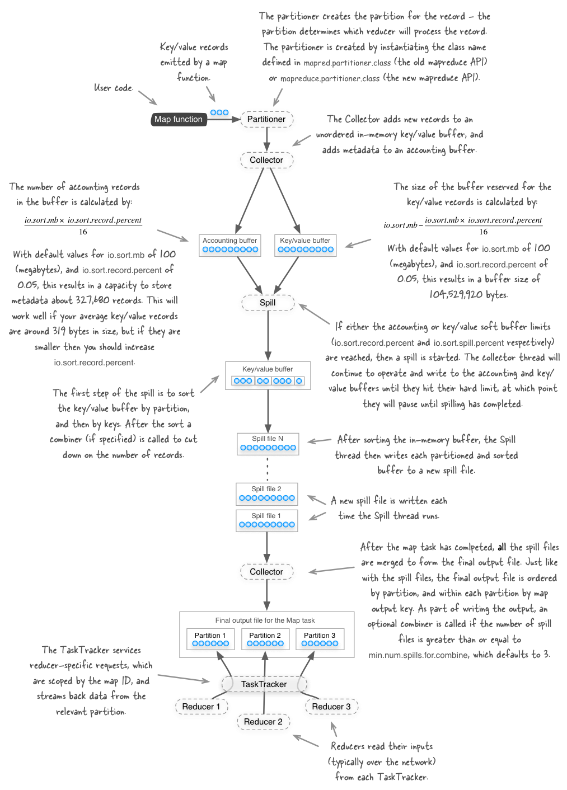

# Hadoop

### Mapper的数量

+ Hadoop采用“数据本地化优化”的策略，使得map端任务到达最佳性能。 在application master为每个分片创建map作业的过程中，MapReduce框架优先选择存储有输入数据的节点来执行map任务。　　

+ 如果所有存储该分片数据的节点都在执行map任务时，作业调度会尝试从数据块所在机架上的其他节点寻找空闲的map槽， 只有当无法在当前机架运行map任务时才在其他机架创建map作业。 因为同一个机架上的两个数据节点之间的数据传输，比跨机架的数据传输有着更高的带宽和更低的延迟响应。　　
+ 此外，因为对任务的分配，初始化数据和数据输出，这个过程比较耗费时间。会出现启动任务花费的时间在整个任务作业的执行中占的时间比较大的情况，这会影响任务的执行效率，因此建议map任务的运行时间最好能在一分钟以上。 但是，和reducer不一样，不能调节mapper的运行时间，只能通过设定分片的大小间接调整mapper的个数。
+ MapReduce框架的输入数据分片是由InputFormat接口来完成的。FileInputFormat提供了三个属性参数来控制实际的分片大小：
  + mapreduce.input.fileinputformat.split.minsize 文件分片最小的有效字节数
  + mapreduce.input.fileinputformat.split.maxsize 文件分片最大的有效字节数
  + dfs.blocksize HDFS中文件块的大小
  + 利用公式splitSize = max(minimumSize, min(maximumSize, blockSize))，可以通过改变上述三个参数来调节最终的分片大小。
+ 需要注意点的是，在调节分片大小时，如果分片过小，会增加管理分片的总时间和构建map任务的总时间，则会增加 整个任务的执行时间。 同时分片大小也不应大于块大小，因为此时无法确保存储有该切片的多个数据块位于单个节点中，会增加执行map任务中的网络传输。 因此对于大多数作业来说，一个合理的分片大小趋向于HDFS的一个块的大小，默认是128MB。
+ 由于数据分片对有效字节数小于maximumSize的文件并不进行拆分，并且进行拆分的大文件的大小并非恰好为文件块大小的倍数，因此分片大小并不确定。 为了最小化运行时间，Hadoop采用了类似贪心算法的策略来优先处理最大的分片。 分片大小的信息和指向分片数据的引用均包含在输入分片中，供application master使用。　　
+ 另一个会影响Mapper个数的参数是mapred.jobtracker.maxtasks.per.job，不过其只能限制每个job中能够并发运行的map或reduce任务的上限。

### Reducer的数量

+ Reducer的个数可以由用户独立设置的，在默认情况下只有一个Reducer。 它的个数既可以使用命令行参数设置(mapreduce.job.reduces=number)，也可以在程序中制定(job.setNumReduceTasks(number))。　　
+ 适当的增加reducer的数量可以提高执行效率，但是不能过多，因为reducer数量过多，会产生过多的小文件，占用过多的内存。　　
  + 为了更加高效地完成reduce任务，Reducer的个数需要依据自己的任务特点和机器负载情况进行选择。 Hadoop权威指南给出的一条经验法则是：目标Reducer保持在每个运行5分钟左右，且产生至少一个HDFS块的输出。 而Apache的MapReduce官方教程中给出的建议是：Reducer个数应该设置为0.95或者1.75乘以节点数与每个节点的容器数的乘积。 当乘数为0.95时，map任务结束后所有的reduce将会立刻启动并开始转移数据， 此时队列中无等待任务，该设置适合reudce任务执行时间短或者reduce任务在个节点的执行时间相差不大的情况; 当乘数为1.75时，运行较快的节点将在完成第一轮reduce任务后，可以立即从队列中取出新的reduce任务执行， 由于该reduce个数设置方法减轻了单个reduce任务的负载，并且运行较快的节点将执行新的reduce任务而非空等执行较慢的节点，其拥有更好的负载均衡特性。

