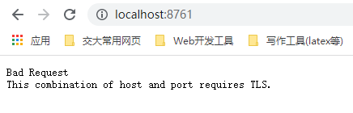
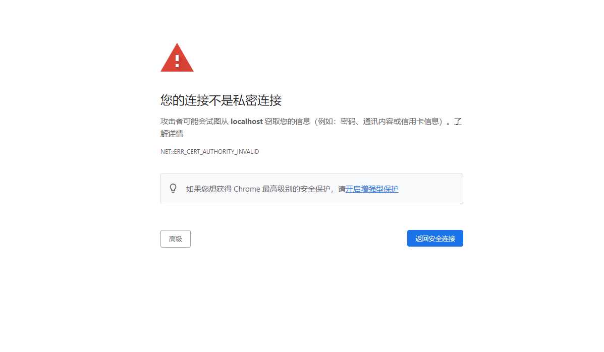
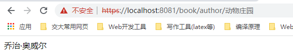
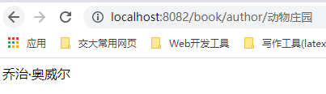

# 说明文档

### Micro Service

文件结构

```
.
├── CatStore
	├── ...
    	└── catstore-backend
		├── ...
		├── bookservice 
        	├── eureka_server
 		└── gateway
```

整体结构:


### Security

将服务器配置为HTTPS之后，对服务器进行访问出现了如下界面



发现用原来的HTTP方式访问服务器失败了，这是因为我将服务器配置为了HTTPS，并且设置为只能用HTTPS访问，（当然也可以设置为两者都能访问）

当我转而使用HTTPS访问的时候，出现了如下界面：



这是因为虽然我配置了HTTPS并且我试图通过HTTPS对网站进行访问，但是由于我们所使用的证书并没有经过第三方电子签证机关（CA）认证，所以我所使用的的Chrome浏览器将其认定为不安全的，不可信的。（不能保证我们的证书提供的公钥是安全可信的。）

注意到，即使我们已经安装了该证书，Chrome依旧显示为不安全，经查阅：

`为了确保您安全上网，Chrome 会要求网站使用来自受信任组织发放的证书。`

所以Chrome的安全等级是很高的。

接着把网关配置为https（逻辑上感觉网关配置https就行，因为服务如果不暴露给外网的话，内部走http就行。网关因为要走外网，所以配置为https）

由于微服务用的是http，所以发送给网关的https请求会通过网关映射为http请求，并由网关转发到对应的host上。

相关的filter代码位于package com.catstore.gateway.filter这个包下。（网关相关文件位置如说明文档最上方所示）

配置之后的效果：





网关能够正常转发，和直接用http访问是一样的。

总而言之，Https不同于Http对传输的数据进行的加密的工作：

+ 消息摘要
+ 使用公钥和私钥的非对称加密体系
+ 使用第三方电子签证机关CA

整体流程：

CA对Server的公钥文件用私钥进行加密，如果Client能用CA的公钥解开加密过的Server的公钥，那么就说明该公钥是可以被信任的。Client可以用该公钥与Server进行交互。

Server将内容通过信息摘要算法生成摘要，并把摘要用私钥加密。用户如果能够用Server的公钥解开，就说明该信息没有被拦截伪造，确实是Server发送过来的。然后用相同的信息摘要算法对内容生成摘要，判断两个摘要是否一致，如果一致，那就说明内容没有被拦截修改，信息是安全可信的。

而Http则是简单地将数据进行传输，没有经过上述的加密过程，所以有潜在的安全风险。

