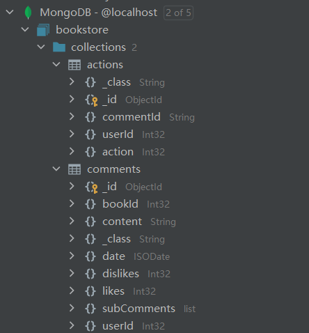
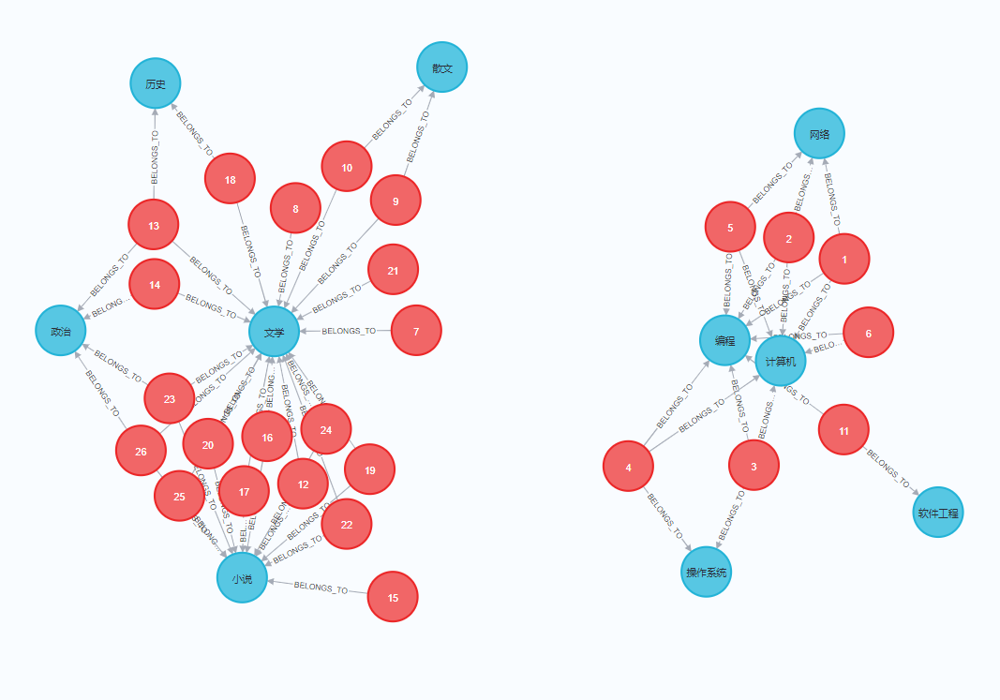
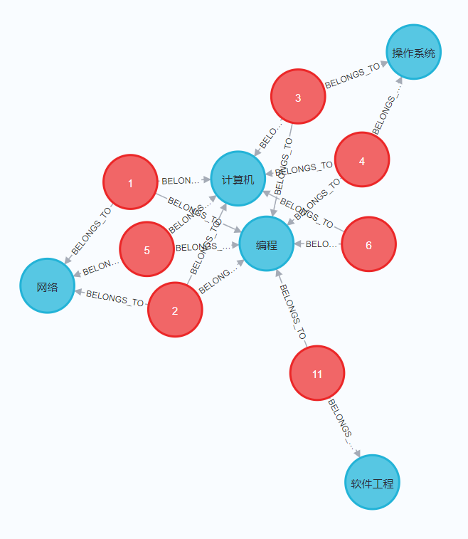

# 说明文档

### MongoDB

本电子书店系统采用MongoDB完成对评论信息的存储。

相关代码位于：

+ entity.Comment 和 entity.CommentAction: 评论和评论相关动作（点赞、点踩）的实体类。
+ dao，service和controller层对comment相关操作均进行了封装。

MongoDB中的存储结构如下所示：



评论效果如下图所示：


### Neo4j

#### 准备工作

+ 为了在Neo4j中存储书籍标签关系，我创建了两个实体类：Book4Neo 和BookTag，分别位于entity包中。

+ 将数据存入Neo4j：

  + 书籍标签数据CSV文件：

    ```csv
    1,计算机,编程,网络
    2,计算机,编程,网络
    3,计算机,编程,操作系统
    4,计算机,编程,操作系统
    5,计算机,编程,网络
    ...
    ```

  + 处理语句（位于最外层）

    用于将标签存入Neo4j

    ```java
    //    @PostConstruct
    void prepareForNeo4j() throws IOException {
        String url = "./src/main/resources/neo4j/book.csv";
        BufferedReader br = new BufferedReader(new FileReader(url));
        String line;
        Map<String, BookTag> tagMap = new HashMap<>();
        List<Book4Neo> books = new ArrayList<>();
        while (!(line = br.readLine()).isEmpty()) {
            List<String> tuple = Arrays.asList(line.split(",").clone());
            System.out.println("Read line: " + tuple.toString());
            int bookId = Integer.parseInt(tuple.get(0));
            Book4Neo book = new Book4Neo();
            book.setBookId(bookId);
            List<BookTag> tags = new ArrayList<>();
            for (int i = 1; i < tuple.size(); ++i) {
                String tag = tuple.get(i);
                if (!tagMap.containsKey(tag))
                    tagMap.put(tag, new BookTag(tag));
                tags.add(tagMap.get(tag));
            }
            book.addTags(tags);
            books.add(book);
        }
        for (Map.Entry<String, BookTag> entry : tagMap.entrySet()) {
            bookTagRepository.save(entry.getValue());
        }
        for (Book4Neo book : books) {
            bookRepository4Neo.save(book);
        }
    }
    ```

+ 插入结果

  

+ 前端

  添加按标签搜索的功能：

  

### 搜索

使用@Query配合原生Cypher进行搜索，将所有符合条件的书籍搜索出来（直接关系+二重关系）。

相关语句如下所示：

```java
@Query(value = "match (t1:tag)--()-->(t2:tag) match (n:book)-[:BELONGS_TO]->(t:tag) where t1.tag in $tags and (t=t1 or t=t2) return n")
List<Book4Neo> searchByTags(@Param(value = "tags") List<String> tags);
```

搜索“编程”：

在**browser**中搜素结果如下所示：



**前端**搜索结果如下所示：


