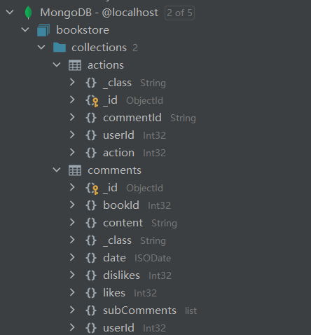

# 说明文档

### MongoDB

本电子书店系统采用MongoDB完成对评论信息的存储。

相关代码位于：

+ entity.Comment 和 entity.CommentAction: 评论和评论相关动作（点赞、点踩）的实体类。
+ dao，service和controller层对comment相关操作均进行了封装。

MongoDB中的存储结构如下所示：

评论效果如下图所示：

